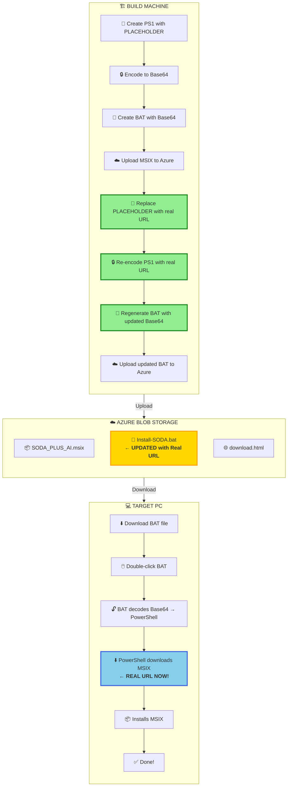

# SODA+ AI

**SQL Object Dependency Analyzer with AI-Powered Code Review**

[](https://sodaplusbeta.blob.core.windows.net/downloads/download_1.0.8-beta.html)
[](https://sodaplusbeta.blob.core.windows.net/downloads/download_1.0.8-beta.html)
[](https://dotnet.microsoft.com/)
[](https://github.com/jcboyer/SODA_PLUS_AI/blob/main/LICENSE.md)

---

## 🚀 What is SODA+ AI?

SODA+ AI is a powerful tool for SQL Server developers and DBAs that combines **dependency analysis** with **AI-powered code review**. Understand your database schema, visualize dependencies, and get intelligent recommendations for optimizing your SQL code.

### Key Features

✨ **Interactive Dependency Visualization**
- Multi-level drill-down through stored procedures, functions, views, and tables
- Visual impact analysis - see what depends on what
- Identify circular dependencies and unused objects

🤖 **AI-Powered Code Review**
- Context-aware analysis of your SQL code
- Best practice recommendations
- Performance optimization suggestions
- Security vulnerability detection

📊 **Advanced Charting**
- Mermaid diagram generation
- SVG export for documentation
- Multiple visualization modes
- Beautiful, professional diagrams

☁️ **Cloud Integration**
- Secure API key management
- Cloud-based analysis powered by Azure
- Automatic updates
- Zero configuration required

---

## 📥 Download & Install

### **Latest Version: 1.0.8-beta**

**[📦 Download Installer](https://sodaplusbeta.blob.core.windows.net/downloads/Install-SODA_1.0.8-beta.bat)** ← Just double-click to install!

**[🌐 Full Download Page](https://sodaplusbeta.blob.core.windows.net/downloads/download_1.0.8-beta.html)**

### Quick Installation (3 Steps)

1. **Download** the installer (BAT file)
2. **Double-click** `Install-SODA_1.0.6-beta.bat`
3. **Launch** from Start Menu → Search "SODA+ AI"

That's it! No admin rights needed, no manual configuration required.

### System Requirements

- **OS**: Windows 10/11 (64-bit)
- **RAM**: 4GB minimum (8GB recommended)
- **Storage**: ~100MB for application + ~50MB for chart rendering tools (downloaded on first use)
- **Internet**: Required for AI features and chart rendering setup

## 🔄 Build & Deployment Workflow

### MSIX Package Build Process

The build system uses a sophisticated Base64-encoded installer to ensure the BAT file is self-contained and includes the correct Azure Blob Storage URL:



### Key Features

- ✅ **Self-Contained Installer**: BAT file includes all PowerShell code (Base64 encoded)
- ✅ **Dynamic URL Injection**: Real Azure Blob URL is injected during build
- ✅ **No External Dependencies**: User only needs to download one file
- ✅ **Automatic MSIX Installation**: PowerShell handles download and installation
- ✅ **Progress Reporting**: Real-time download progress display

### Build Command

```powershell
.\Build-Publish-Upload-MSIX.ps1 -Version "1.0.8-beta"
```

### User Experience

1. User downloads `Install-SODA_1.0.8-beta.bat` (21 KB)
2. Double-clicks the BAT file
3. PowerShell automatically downloads MSIX (~84 MB)
4. MSIX installs with Start Menu integration
5. Done! 🎉


---

## 🎯 Quick Start Guide

1. **Launch SODA+ AI** from Start Menu
2. **Connect to SQL Server**
   - Enter server name
   - Choose authentication method
   - Select database
3. **Explore Dependencies**
   - Right-click any object (stored proc, view, table)
   - Select "Show Dependencies"
   - Drill down into related objects
4. **Generate Charts**
   - Select objects to visualize
   - Click "Chart → Generate Mermaid"
   - Export as SVG for documentation
5. **AI Code Review**
   - Select a stored procedure or function
   - Click "AI Review"
   - Get instant recommendations

### First-Time Chart Rendering Setup

When you first use the **Chart → Render SVG** feature:
- SODA+ AI automatically downloads Node.js (~50MB)
- Installs Mermaid rendering tools (~2 minutes)
- Saves setup to `%LocalAppData%\MermaidRenderer\`

This happens **once**, then chart rendering is instant! ✨

---

## 📸 Screenshots

### Dependency Tree View


### AI-Powered Code Review


### Mermaid Diagram Export


---

## 🔧 For Developers

### Building from Source

**Prerequisites:**
- Visual Studio 2022 (v17.12+)
- .NET 8 SDK
- .NET 10 SDK (preview)
- Windows 10 SDK (for MSIX packaging)


### Project Structure

```
SODA_PLUS_AI_ReleasedBeta/
├── SODA_PLUS_MAIN/              # Main WPF application (.NET 10)
├── SODA_PLUS_DEPENDENCIES/      # Core dependency analysis library
├── SODA_PLUS_CHARTING/          # Mermaid chart generation
├── SODA_PLUS_AI_REVIEW/         # AI integration layer
├── MermaidRenderer/             # Node.js-based SVG renderer (.NET 10)
├── SODA_PLUS_AZURE_FUNCTIONS/   # Backend Azure Functions
└── Build-Publish-Upload-MSIX.ps1 # Automated build & deployment
```

### Technologies Used

- **Frontend**: WPF (.NET 10), XAML
- **Backend**: Azure Functions (.NET 8), Azure Blob Storage
- **AI**: Azure OpenAI, GPT-4 integration
- **Charting**: Mermaid.js, Node.js renderer
- **Database**: SQL Server (all versions), Azure SQL
- **Packaging**: MSIX, Windows App Installer

---

## 🛠️ Uninstallation

**Windows Settings:**
1. Open Settings → Apps
2. Search for "SODA+ AI"
3. Click Uninstall
---

## 📖 Documentation

- [User Guide](SODA_PLUS_MAIN/Resources/SODA_PLUS_User_Guide.md)
- [API Documentation](docs/API.md)
- [Chart Syntax Guide](docs/CHARTING.md)
- [Deployment Guide](docs/DEPLOYMENT.md)

---

## 🐛 Found a Bug?

This is a **beta release** - your feedback helps make SODA+ AI better!

**Report issues:**
- [GitHub Issues](https://github.com/jcboyer/SODA_PLUS_AI/issues)
- Include:
  - Windows version
  - SQL Server version
  - Steps to reproduce
  - Screenshots if applicable

---

## 🗺️ Roadmap

### v1.0.0 (Q4 2025)
- ✅ Core dependency analysis
- ✅ AI-powered code review
- ✅ Mermaid chart generation
- 🚧 Code signing certificate
- 🚧 Performance optimizations

### v1.1.0 (Q1 2026)
- 📋 AI based Schema comparison 
- 📋 Change tracking
- 📋 Team collaboration features
- 📋 Custom AI prompts
- 📋 AI SQL Agent Analysis


### v2.0.0 (Future)
- 📋 Multi-database support (PostgreSQL, MySQL)
- 📋 CI/CD integration
- 📋 Advanced reporting

---

## 🤝 Contributing

Contributions are welcome! Please:

1. Fork the repository
2. Create a feature branch (`git checkout -b feature/AmazingFeature`)
3. Commit your changes (`git commit -m 'Add AmazingFeature'`)
4. Push to the branch (`git push origin feature/AmazingFeature`)
5. Open a Pull Request

---

## 📄 License

This project is licensed under the MIT License - see the [LICENSE.md](https://github.com/jcboyer/SODA_PLUS_AI/blob/main/LICENSE.md) file for details.

---

## 💡 Why MSIX?

SODA+ AI uses **MSIX packaging** for modern, secure deployment:

✅ **No Admin Rights Required** - Installs in user space  
✅ **Automatic Updates** - Get new features seamlessly  
✅ **Clean Uninstall** - Zero leftover files or registry entries  
✅ **Start Menu Integration** - Shortcuts created automatically  
✅ **Windows Store Ready** - Production version will be in Microsoft Store  

---

## 🙏 Acknowledgments

- [Mermaid.js](https://mermaid.js.org/) - Diagram generation
- [Azure OpenAI](https://azure.microsoft.com/en-us/products/ai-services/openai-service) - AI capabilities
- [Material Design Icons](https://materialdesignicons.com/) - UI icons
- Community contributors and beta testers

---

## 📞 Contact

- **GitHub**: [@jcboyer](https://github.com/jcboyer)
- **Issues**: [Report a bug](https://github.com/jcboyer/SODA_PLUS_AI/issues)
- **Discussions**: [Community forum](https://github.com/jcboyer/SODA_PLUS_AI/discussions)

---

<div align="center">

**Made with ❤️ for SQL Server developers**

[Download](https://sodaplusbeta.blob.core.windows.net/downloads/download_1.0.6-beta.html) • [Documentation](docs/) • [Issues](https://github.com/jcboyer/SODA_PLUS_AI/issues) • [Discussions](https://github.com/jcboyer/SODA_PLUS_AI/discussions)

</div>
