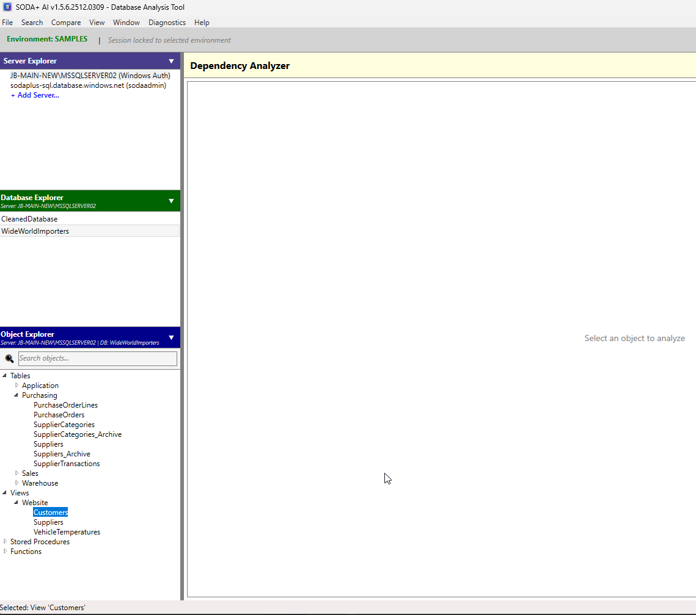
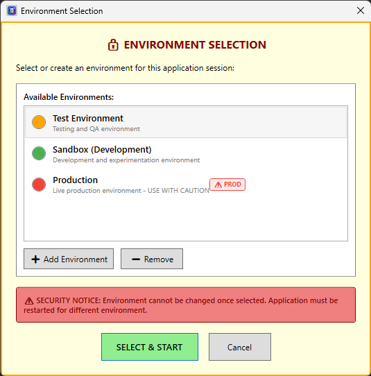
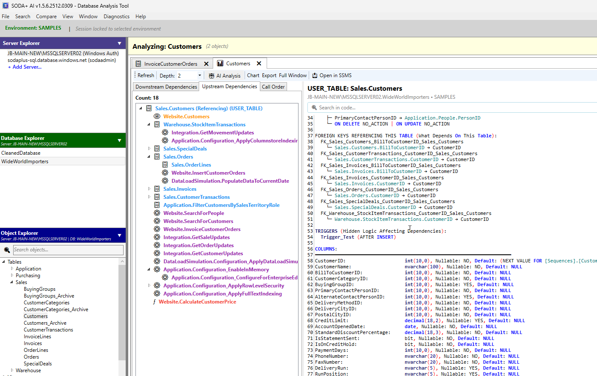
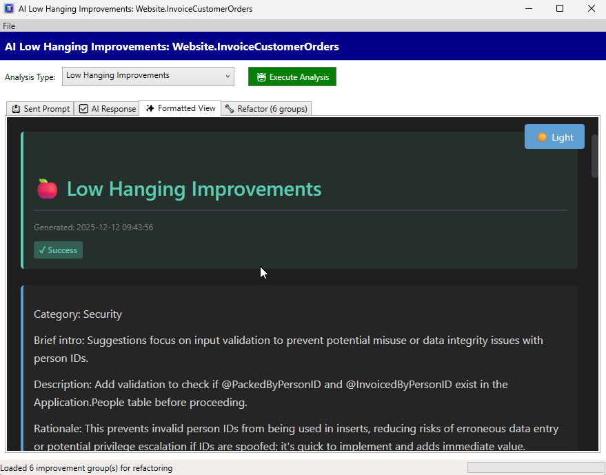
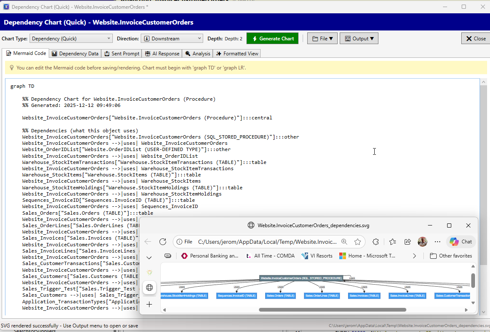

# SqlLens - SQL Server Analysis & Visualization

---

## 🧪 Beta Testers Wanted!

### We need YOUR help to make SqlLens better! 🚀

**Try the latest version on your SQL Server environments and share your feedback.**

### 📦 Get Started in 3 Steps

1. **[⬇️ Download the Latest Beta](https://sqllens.blob.core.windows.net/downloads/download.html)**
2. **Double-click `Install-SODA_Latest.bat`** (no admin rights needed!)
3. **Launch from Start Menu** → Search "SqlLens"

### 🎯 What We're Looking For

We're especially interested in feedback on:

- 🐛 **Bug Reports** - Anything not working as expected?
- 💡 **Feature Suggestions** - What would make your workflow better?
- 🤖 **AI Code Review Accuracy** - Are Grok-4's suggestions helpful for your SQL code?
- 🎨 **Usability Issues** - Is the interface intuitive? Anything confusing?
- ⚡ **Performance** - Speed issues on large databases (1000+ objects)?
- 🔗 **SQL Server Compatibility** - Testing on various versions (2008-2022, Azure SQL)?

### 📢 How to Share Feedback

Choose the method that works best for you:

| Method | Best For | Link |
|--------|----------|------|
| 🐛 **GitHub Issues** | Bug reports, specific problems | [Report Issue](https://github.com/jcboyer/sqllens-docs/issues/new?labels=beta-feedback) |
| 💬 **GitHub Discussions** | General feedback, questions, ideas | [Beta Testing Thread](https://github.com/jcboyer/sqllens-docs/discussions) |
| 📧 **Direct Email** | Private feedback, security concerns | [Contact via GitHub](https://github.com/jcboyer) |

### ✅ Beta Testing Requirements

| Requirement | Details |
|-------------|---------|
| **Operating System** | Windows 10 or Windows 11 (64-bit) |
| **SQL Server Access** | SQL Server 2008+ (any edition, including Azure SQL) |
| **AI Features** | Optional xAI/Grok API key - Included for the Beta ([get one free](https://x.ai/)) |
| **Internet Connection** | Required for Login and AI features and updates |
| **Time Commitment** | 30 minutes to 2 hours (your choice!) |

### 🎁 Beta Tester Benefits

- ✅ **Early access** to new features
- ✅ **Direct influence** on product direction
- ✅ **Priority support** for reported issues
- ✅ **Recognition** in release notes (if you'd like)
- ✅ **Free lifetime license** when we go commercial (limited to first 100 beta testers!)

### 📊 Current Beta Status

- **Active Beta Testers:** Looking for 50-100 participants
- **Testing Period:** Ongoing (rolling updates)
- **Next Major Release:** Targeting Q1 2026

### 🙏 Thank You for Helping Us Build Something Great!

Every bug report, suggestion, and piece of feedback helps make SqlLens better for the entire SQL Server community. We read and respond to every submission!

---

## 🎬 Quick Demo

**Watch SqlLens in action!** See how to analyze SQL Server dependencies in just 2 minutes:

**[▶️ Watch Demo Video (2 min)](https://youtu.be/ecZOFDrbr9I)**

---

## 🚀 Quick Start

1. **[⬇️ Download Latest Release](https://sqllens.blob.core.windows.net/downloads/download.html)** (Always up-to-date)
2. Double-click `Install-SODA_Latest.bat`
3. Launch from Start Menu → Search "SqlLens"
4. Login with your email address
5. Connect to your SQL Server and start analyzing!

---

## 📚 Documentation

| Guide | Time | Description |
|-------|------|-------------|
| 🚀 [Quick Start Guide](docs/Quick_Start_Guide.md) | 5 min | Perfect for first-time users |
| 📘 [Concise Guide](docs/Concise_Guide.md) | 30 min | Essential features (80% of what you need) |
| 🔍 [Reference Guide](docs/Reference_Guide.md) | Instant | Alphabetical feature lookup |
| 📖 [Full User Guide](docs/User_Guide_Full.md) | 2-3 hrs | Complete reference with all features |
| 🧩 [VS Code Extension Guide](docs/SqlLens_VSCode_Guide.md) | 15 min | Full command reference for the VS Code extension |
| 🤖 [Agent Jobs Guide](docs/SqlLens_Agent_Jobs_Guide.md) | 15 min | SQL Server Agent Job dependency graph, Git drift detection |
| 🛠️ [Developer Docs](docs/developers/) | Varies | Version sync, Azure integration |

**Not sure which guide to use?** See: [Which Guide Should I Use?](docs/README.md#which-guide-should-i-use)

---

## ✨ Key Features

### 🔍 Dependency Analysis
- **Visual dependency mapping** with interactive drill-down
- **Impact analysis** for database objects before making changes
- **Hierarchical dependency trees** (upstream/downstream)
- **Real-time dependency discovery** across multiple databases

### 🤖 AI-Powered Code Review (Grok-4)
- **Intelligent SQL code analysis** with context-aware suggestions
- **Performance optimization** recommendations
- **Security vulnerability detection** (SQL injection, permissions)
- **Best practices** and refactoring suggestions

### 📊 Interactive Visualizations
- **Beautiful Mermaid dependency charts** with customizable depth
- **Logic flowcharts** for procedure/function control flow
- **Export capabilities** (SVG, Mermaid, CSV, JSON, Markdown)
- **Save/load chart files** for reuse and sharing

### 🔄 Cross-Database Search
- **20x faster** parallel search across multiple databases
- **Search inside code** definitions (procedures, functions, views)
- **AI-powered relevance filtering** for accurate results
- **Multi-server support** with connection management

### 🤖 SQL Server Agent Job Management
- **Agent Job dependency graph** — visualize stored procedure calls from each job step
- **Git drift detection** — compare live DB scripts vs committed versions (In Sync / DB Ahead / Git Ahead)
- **Script history** — browse Active and Archived job step scripts stored in Git
- **Repo changes report** — full Git commit history for all Agent scripts with CSV export

### ☁️ Cloud Integration
- **Azure Key Vault** secure API key management
- **User session management** with auto-login
- **Automatic updates** via Azure Blob Storage

---

## 💻 System Requirements

| Requirement | Specification |
|-------------|---------------|
| **Operating System** | Windows 10 or Windows 11 (64-bit) |
| **RAM** | 4GB minimum (8GB recommended) |
| **Disk Space** | ~100MB for application + ~50MB for chart rendering |
| **Internet Connection** | Required for AI features |
| **.NET Runtime** | Included (self-contained) |
| **SQL Server** | 2008 or later (any edition) |

---

## 📝 Latest Release

**Current Version:** See [CHANGELOG](docs/CHANGELOG.md)

For detailed release notes and version history, visit:
- 📄 [Release History](docs/RELEASE_HISTORY.md) - All versions with download links
- 📋 [CHANGELOG](docs/CHANGELOG.md) - Detailed version history

---

## 🎯 Use Cases

### For Database Developers
- Understand complex stored procedure dependencies
- Analyze impact before modifying database objects
- Identify performance bottlenecks with AI assistance
- Document database architecture with visual charts

### For Database Administrators
- Audit database security with AI-powered analysis
- Plan database refactoring with dependency visualization
- Identify unused or obsolete objects
- Generate documentation for compliance

### For Development Teams
- Onboard new developers faster with visual maps
- Review code quality with AI recommendations
- Maintain consistent coding standards
- Collaborate using exported charts and reports

---

## 📥 Resources

| Resource | Link |
|----------|------|
| 📥 **Download** | [Latest Release](https://sqllens.blob.core.windows.net/downloads/download.html) |
| 📖 **Documentation** | [User Guides](docs/) |
| 📄 **Release Notes** | [CHANGELOG](docs/CHANGELOG.md) |
| 📦 **Previous Versions** | [Release History](docs/RELEASE_HISTORY.md) |
| 🐛 **Report Issues** | [GitHub Issues](https://github.com/jcboyer/sqllens-docs/issues) |
| 💬 **Discussions** | [GitHub Discussions](https://github.com/jcboyer/sqllens-docs/discussions) |
| 🧪 **Beta Feedback** | [Beta Testing Thread](https://github.com/jcboyer/sqllens-docs/discussions) |

---

## 🔐 Security & Privacy

- ✅ **No data collection** without explicit consent
- ✅ **Secure Azure Key Vault** API key storage with RBAC
- ✅ **Local SQL analysis** (queries run on your server only)
- ✅ **Encrypted sessions** with Windows DPAPI
- ✅ **Open documentation** (public repo for transparency)

**Security Disclosure:** Please report security vulnerabilities via [GitHub Security Advisories](https://github.com/jcboyer/sqllens-docs/discussions/advisories/new)

---

## 📸 Screenshots

### Main Interface

### Environment Selection

### Dependency Analysis

### AI Code Review

### Dependency Charts

*More screenshots available in [docs/screenshots/](docs/screenshots/)*

---

## 🤝 Contributing

We welcome contributions! Here's how you can help:

### Bug Reports
1. [Open an issue](https://github.com/jcboyer/sqllens-docs/issues/new?template=bug_report.md)
2. Include Windows version and system specs
3. Attach screenshots if applicable
4. Describe steps to reproduce

### Feature Requests
1. [Open an issue](https://github.com/jcboyer/sqllens-docs/issues/new?template=feature_request.md)
2. Describe the use case
3. Explain expected behavior

### Documentation
1. Submit pull requests for documentation improvements
2. Report unclear or missing documentation
3. Share tips and best practices in [Discussions](https://github.com/jcboyer/sqllens-docs/discussions)

---

## 🆘 Support

Need help? We're here for you:

- 📖 **Documentation**: [User Guides](docs/)
- 🔍 **Search Issues**: [Existing Issues](https://github.com/jcboyer/sqllens-docs/issues)
- 🐛 **Report Bugs**: [New Issue](https://github.com/jcboyer/sqllens-docs/issues/new)
- 💬 **Ask Questions**: [GitHub Discussions](https://github.com/jcboyer/sqllens-docs/discussions)

**Response Time:** We typically respond to issues within 24-48 hours.

---

## 📜 License

This software is currently in beta and available for testing purposes.

**Terms:**
- ✅ Free to use for evaluation and testing
- ✅ No warranty or support guarantee
- ⚠️ Not licensed for production use without agreement

For licensing inquiries, please [contact us](https://github.com/jcboyer/sqllens-docs/discussions).

---

## 🎉 Thank You!

Thank you for using SqlLens! Your feedback helps make it better for everyone.

**Special Thanks:**
- All beta testers who provided valuable feedback
- The open-source community for inspiration and tools
- Microsoft for .NET, Azure, and Visual Studio
- X.AI for Grok API integration

---

## 🏗️ Built With

- **.NET 10** & **.NET 8** - Application framework
- **WPF** - User interface
- **Microsoft.Data.SqlClient** - SQL Server connectivity
- **Grok-4 (X.AI)** - AI-powered code analysis
- **Mermaid** - Chart generation
- **Azure Key Vault** - Secure API key management
- **WebView2** - HTML rendering

---

### [⬇️ Download Latest Release Now](https://sqllens.blob.core.windows.net/downloads/download.html)

**Latest Version:** [See CHANGELOG](docs/CHANGELOG.md)

---

**Made with ❤️ by the SqlLens Team**

[Documentation](docs/) • [Issues](https://github.com/jcboyer/sqllens-docs/issues) • [Discussions](https://github.com/jcboyer/sqllens-docs/discussions) • [Release History](docs/RELEASE_HISTORY.md)

