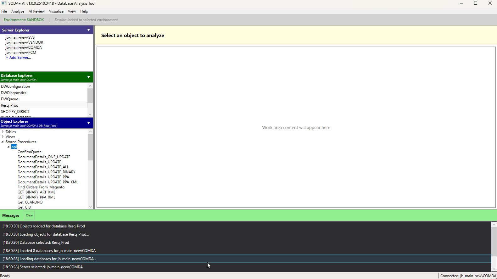

# SODA+ AI - SQL Server Dependency Analysis

---

## 🎬 Quick Demo

**Watch SODA+ AI in action!** See how to analyze SQL Server dependencies in just 2 minutes:

**[▶️ Watch Demo Video (2 min)](https://youtu.be/ecZOFDrbr9I)**

---

## 🚀 Quick Start

1. **[⬇️ Download Latest Release](https://sodaplusbeta.blob.core.windows.net/downloads/download.html)** (Always up-to-date)
2. Double-click `Install-SODA_Latest.bat`
3. Launch from Start Menu → Search "SODA+ AI"
4. Login with your email address
5. Connect to your SQL Server and start analyzing!

**No admin rights needed, no manual configuration required!**

---

## 📚 Documentation

| Guide | Time | Description |
|-------|------|-------------|
| 🚀 [Quick Start Guide](docs/Quick_Start_Guide.md) | 5 min | Perfect for first-time users |
| 📘 [Concise Guide](docs/Concise_Guide.md) | 30 min | Essential features (80% of what you need) |
| 🔍 [Reference Guide](docs/Reference_Guide.md) | Instant | Alphabetical feature lookup |
| 📖 [Full User Guide](docs/User_Guide_Full.md) | 2-3 hrs | Complete reference with all features |
| 🛠️ [Developer Docs](docs/developers/) | Varies | Version sync, Azure integration |

**Not sure which guide to use?** See: [Which Guide Should I Use?](docs/README.md#which-guide-should-i-use)

---

## ✨ Key Features

### 🔍 Dependency Analysis
- **Visual dependency mapping** with interactive drill-down
- **Impact analysis** for database objects before making changes
- **Hierarchical dependency trees** (upstream/downstream)
- **Real-time dependency discovery** across multiple databases

### 🤖 AI-Powered Code Review (Grok-2)
- **Intelligent SQL code analysis** with context-aware suggestions
- **Performance optimization** recommendations
- **Security vulnerability detection** (SQL injection, permissions)
- **Best practices** and refactoring suggestions

### 📊 Interactive Visualizations
- **Beautiful Mermaid dependency charts** with customizable depth
- **Logic flowcharts** for procedure/function control flow
- **Export capabilities** (SVG, Mermaid, CSV, JSON, Markdown)
- **Save/load chart files** for reuse and sharing

### 🔄 Cross-Database Search
- **20x faster** parallel search across multiple databases
- **Search inside code** definitions (procedures, functions, views)
- **AI-powered relevance filtering** for accurate results
- **Multi-server support** with connection management

### ☁️ Cloud Integration
- **Azure Key Vault** secure API key management
- **User session management** with auto-login
- **Automatic updates** via Azure Blob Storage

---

## 💻 System Requirements

| Requirement | Specification |
|-------------|---------------|
| **Operating System** | Windows 10 or Windows 11 (64-bit) |
| **RAM** | 4GB minimum (8GB recommended) |
| **Disk Space** | ~100MB for application + ~50MB for chart rendering |
| **Internet Connection** | Required for AI features |
| **.NET Runtime** | Included (self-contained) |
| **SQL Server** | 2008 or later (any edition) |

---

## 📝 Latest Release

**Current Version:** See [CHANGELOG](docs/CHANGELOG.md)

For detailed release notes and version history, visit:
- 📄 [Release History](docs/RELEASE_HISTORY.md) - All versions with download links
- 📋 [CHANGELOG](docs/CHANGELOG.md) - Detailed version history

---

## 🎯 Use Cases

### For Database Developers
- Understand complex stored procedure dependencies
- Analyze impact before modifying database objects
- Identify performance bottlenecks with AI assistance
- Document database architecture with visual charts

### For Database Administrators
- Audit database security with AI-powered analysis
- Plan database refactoring with dependency visualization
- Identify unused or obsolete objects
- Generate documentation for compliance

### For Development Teams
- Onboard new developers faster with visual maps
- Review code quality with AI recommendations
- Maintain consistent coding standards
- Collaborate using exported charts and reports

---

## 📥 Resources

| Resource | Link |
|----------|------|
| 📥 **Download** | [Latest Release](https://sodaplusbeta.blob.core.windows.net/downloads/download.html) |
| 📖 **Documentation** | [User Guides](docs/) |
| 📄 **Release Notes** | [CHANGELOG](docs/CHANGELOG.md) |
| 📦 **Previous Versions** | [Release History](docs/RELEASE_HISTORY.md) |
| 🐛 **Report Issues** | [GitHub Issues](https://github.com/jcboyer/SODA_PLUS_AI/issues) |
| 💬 **Discussions** | [GitHub Discussions](https://github.com/jcboyer/SODA_PLUS_AI/discussions) |

---

## 🔐 Security & Privacy

- ✅ **No data collection** without explicit consent
- ✅ **Secure Azure Key Vault** API key storage with RBAC
- ✅ **Local SQL analysis** (queries run on your server only)
- ✅ **Encrypted sessions** with Windows DPAPI
- ✅ **Open documentation** (public repo for transparency)

**Security Disclosure:** Please report security vulnerabilities via [GitHub Security Advisories](https://github.com/jcboyer/SODA_PLUS_AI/security/advisories/new)

---

## 📸 Screenshots

### Main Interface

### Environment Selection

### Dependency Analysis

### AI Code Review

### Dependency Charts

*More screenshots available in [docs/screenshots/](docs/screenshots/)*

---

## 🤝 Contributing

We welcome contributions! Here's how you can help:

### Bug Reports
1. [Open an issue](https://github.com/jcboyer/SODA_PLUS_AI/issues/new?template=bug_report.md)
2. Include Windows version and system specs
3. Attach screenshots if applicable
4. Describe steps to reproduce

### Feature Requests
1. [Open an issue](https://github.com/jcboyer/SODA_PLUS_AI/issues/new?template=feature_request.md)
2. Describe the use case
3. Explain expected behavior

### Documentation
1. Submit pull requests for documentation improvements
2. Report unclear or missing documentation
3. Share tips and best practices in [Discussions](https://github.com/jcboyer/SODA_PLUS_AI/discussions)

---

## 🆘 Support

Need help? We're here for you:

- 📖 **Documentation**: [User Guides](docs/)
- 🔍 **Search Issues**: [Existing Issues](https://github.com/jcboyer/SODA_PLUS_AI/issues)
- 🐛 **Report Bugs**: [New Issue](https://github.com/jcboyer/SODA_PLUS_AI/issues/new)
- 💬 **Ask Questions**: [GitHub Discussions](https://github.com/jcboyer/SODA_PLUS_AI/discussions)

**Response Time:** We typically respond to issues within 24-48 hours.

---
## ⚠️ Free Trial
- SODA+ AI is free to download, test, and evaluate until March 31, 2026.
- AI features (Grok-powered analysis) are included at no cost during the trial but subject to usage limits to manage developer expenses.
- Post-trial: We may introduce paid tiers for unlimited AI, require your own API key, or disable it in the free version. Core dependency analysis remains free and open.
- Production use? Contact us for licensing.

## 📜 License

This software is currently in beta and available for testing purposes.

**Terms:**
- ✅ Free to use for evaluation and testing
- ✅ No warranty or support guarantee
- ⚠️ Not licensed for production use without agreement

For licensing inquiries, please [contact us](https://github.com/jcboyer/SODA_PLUS_AI/discussions).

---

## 🎉 Thank You!

Thank you for using SODA+ AI! Your feedback helps make it better for everyone.

**Special Thanks:**
- All beta testers who provided valuable feedback
- The open-source community for inspiration and tools
- Microsoft for .NET, Azure, and Visual Studio
- X.AI for Grok API integration

---

## 🏗️ Built With

- **.NET 10** & **.NET 8** - Application framework
- **WPF** - User interface
- **Microsoft.Data.SqlClient** - SQL Server connectivity
- **Grok-2 (X.AI)** - AI-powered code analysis
- **Mermaid** - Chart generation
- **Azure Key Vault** - Secure API key management
- **WebView2** - HTML rendering

---

### [⬇️ Download Latest Release Now](https://sodaplusbeta.blob.core.windows.net/downloads/download.html)

**Latest Version:** [See CHANGELOG](docs/CHANGELOG.md)

---

**Made with ❤️ by the SODA+ AI Team**

[Documentation](docs/) • [Issues](https://github.com/jcboyer/SODA_PLUS_AI/issues) • [Discussions](https://github.com/jcboyer/SODA_PLUS_AI/discussions) • [Release History](docs/RELEASE_HISTORY.md)

