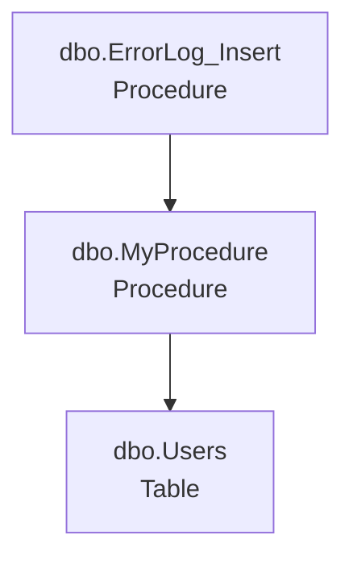
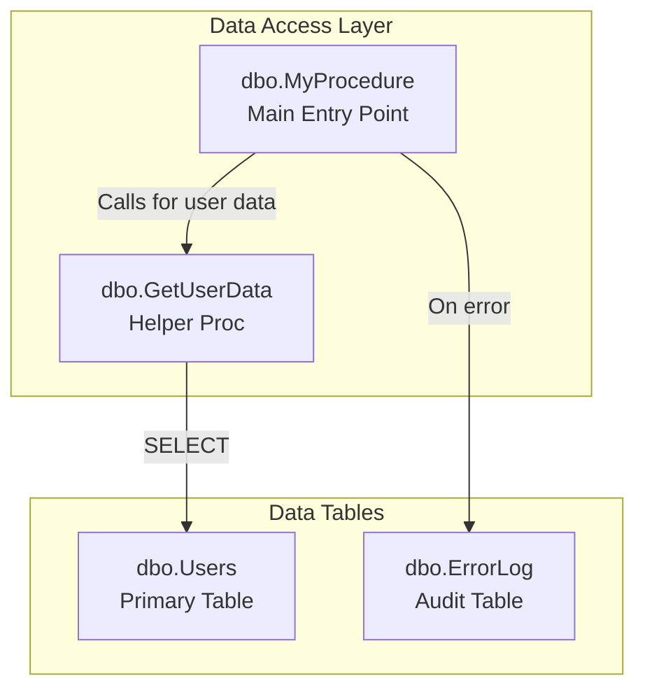

# SODA PLUS - SQL Object Dependency Analyzer
## Step-by-Step User Guide

---

## 📑 **Table of Contents**

### **📚 Getting Started**
- [Step 0: Initial Login & Registration](#step-0-initial-login--registration-new-) ⭐ **NEW!**
- [Step 1: Launch the Application](#step-1-launch-the-application)
- [Step 2: Environment Selection](#step-2-environment-selection)
- [Main Interface Overview](#main-interface-overview)

### **🔧 Basic Setup**
- [Step 3: Connect to Servers](#step-3-connect-to-servers-enhanced-) ⭐ **ENHANCED!**
- [Step 4: Select a Server](#step-4-select-a-server)
- [Step 5: Select a Database](#step-5-select-a-database)
- [Step 6: Search for Objects](#step-6-search-for-objects-new-) ⭐ **NEW!**

### **⚡ Core Features**
- [Step 7: Analyze Database Objects](#step-7-analyze-database-objects-enhanced-) ⭐ **ENHANCED!**
- [Step 8: Review Analysis Results](#step-8-review-analysis-results)
- [Step 8a: Drill-Down Dependency Analysis](#step-8a-drill-down-dependency-analysis-new-) ⭐ **NEW!**

### **🤖 AI & Advanced Analysis**
- [Step 9: AI Code Analysis](#step-9-ai-code-analysis---new-enhanced-workflow-)
- [Step 9a: Working with Refactor Suggestions](#step-9a-working-with-refactor-suggestions-new-) ⭐ **NEW!**
- [Step 10: Dependency Charting](#step-10-dependency-charting-new-)
- [Step 11: Working with AI Analysis Types](#step-11-working-with-ai-analysis-types)
- [Step 12: Advanced AI Features](#step-12-advanced-ai-features)

### **🎯 Workspace & Navigation**
- [Step 13: Navigation and Workspace Management](#step-13-navigation-and-workspace-management)
- [Advanced Features](#advanced-features)

### **📖 Reference**
- [Typical AI Analysis & Refactoring Workflow](#typical-ai-analysis--refactoring-workflow)
- [Help and Support](#help-and-support)
- [Tips for Best Results](#tips-for-best-results)

---


### **Step 0: Initial Login & Registration** (NEW! 🎯)

When you first launch SODA PLUS AI, you'll be prompted to login or register to access AI-powered features.

#### **Why Login?**
- **Secure API Key Management** - Your Grok AI API key is securely stored and encrypted
- **Usage Tracking** - Monitor your monthly AI analysis quota
- **Session Management** - Stay logged in across application restarts
- **Multi-User Support** - Each user gets their own API key assignment

#### **Registration Process:**
1. **Login Dialog Appears** on first launch
2. Switch to the **Register** tab
3. **Fill in Registration Form:**
   - **Email:** Your email address (used as login ID)
   - **Display Name:** Your full name or nickname
   - **Company:** (Optional) Your organization name
4. Click **📝 Register**
5. **System Actions:**
   - Creates your user account
   - Assigns you a Grok API key from the pool
   - Sets default environment to SANDBOX
   - Configures AI analysis settings
6. **Success Message Shows:**
   ```
   ✅ Registration successful!
   Welcome, [Your Name]!
   
   ⚠️ Please switch to the Login tab and login to complete the process.
   ```
7. **Switch to Login tab** (email pre-filled for convenience)
8. Click **🔑 Login** to complete

#### **Login Process:**
1. **Enter your email** in the Login tab
2. Click **🔑 Login**
3. **System Validates:**
   - User exists and is active
   - API key is valid and active
   - Session token is generated
4. **Success Message Shows:**
   ```
   ✅ Welcome back, [Your Name]!
   API Key: xai-57C...XQzUZ (masked)
   Session: tok-9f8...2a1b (masked)
   Usage: 5/100 this month
   
   🔒 Secure session established!
   ```
5. **Session Saved Locally:**
   - Encrypted file stored in `%APPDATA%\SODA_PLUS\user_session.dat`
   - Uses Windows DPAPI (Data Protection API)
   - Only readable by your Windows user account
   - Auto-login on next application launch

#### **Session Features:**
**Auto-Login:**
- If you have a valid session file, you'll automatically login
- No need to re-enter credentials each time
- Session expires after 1 year (can be configured)

**Logout:**
- File menu → Logout (if available)
- Or delete session file manually to force re-login

**Security:**
- API keys encrypted using Windows DPAPI
- Session tokens rotate periodically
- Password storage uses industry-standard encryption
- Cannot decrypt credentials from another Windows user

#### **Troubleshooting Login:**
**Issue: "User not found"**
- **Solution:** Register first using the Register tab
- Make sure email is correct

**Issue: "Account disabled"**
- **Solution:** Contact system administrator
- Your account may have been deactivated

**Issue: "No API keys available"**
- **Solution:** All API keys are currently assigned
- Contact administrator to add more keys
- Wait for users to return unused keys

**Issue: "Session cache incomplete" warning**
- **Cause:** Bug in session caching (rare)
- **Action:** Report to developer
- **Workaround:** Login should still work, but report the issue

**Issue: Session file corrupted**
- **Solution:** Delete `%APPDATA%\SODA_PLUS\user_session.dat`
- Login again to recreate session

[↑ Back to Top](#-table-of-contents)

---

### **Getting Started**

#### **Step 1: Launch the Application**
1. Run SODA_PLUS_MAIN.exe
2. **If first launch:** Login/Registration dialog appears (see Step 0)
3. **If returning user:** Auto-login from saved session
4. The application will then prompt you to select an environment

#### **Step 2: Environment Selection** 
1. **Environment Selection Dialog** will appear with options:
   - **SANDBOX** (Green - Safe for testing)
   - **TEST** (Orange - Development environment) 
   - **PROD** (Red - Production with warning)
2. Select your target environment
3. Click **Apply** to continue
4. **⚠️ Production Warning**: If you select PROD, you'll get a safety confirmation dialog


*Figure 1: Choose your environment - SANDBOX (green), TEST (orange), or PROD (red)*

---

### **Main Interface Overview**


*Figure 2: Main application window showing Server/Database/Object Explorer (left), Analysis area (center), and Messages (bottom)*

The main window has 4 key areas:
- **Left Panel**: Server/Database/Object Explorer (3-tier hierarchy)
- **Center Panel**: Main work area for analysis results
- **Bottom Panel**: Messages and log output
- **Top**: Menu bar and environment status

---

### **Step 3: Connect to Servers** (ENHANCED! 🎯)

SODA PLUS now features **enhanced server management** with support for both Windows and SQL Server authentication, encrypted credential storage, and per-environment server configurations.

#### **New Server Configuration Features:**
- ✅ **Dual Authentication Support** - Windows or SQL Server authentication
- ✅ **Encrypted Password Storage** - Uses Windows DPAPI for security
- ✅ **Display Names** - Give servers friendly names
- ✅ **Connection Testing** - Test before saving
- ✅ **Per-Environment Storage** - Different servers per TEST/SANDBOX/PROD
- ✅ **Secure Credential Management** - Passwords stored encrypted, per-user

#### **Adding Your First Server - Enhanced Dialog**

1. In the **Server Explorer** (top-left), you'll see "No servers configured"
2. **Right-click** in the Server Explorer area
3. Select **"Add Server..."** from context menu
4. **Enhanced Add Server Dialog Opens:**

**Dialog Features:**

**Server Name Section:**
- **Server name:** Enter your SQL Server instance
  - Examples: `localhost`, `.\SQLEXPRESS`, `server.domain.com\INSTANCE`
  - Dropdown shows recent servers for quick selection
  - Example suggestions pre-populated:
    - `localhost`
    - `.\SQLEXPRESS`
    - `(localdb)\MSSQLLocalDB`
- **Display Name:** (Optional) Friendly name like "Dev Server" or "Production DB"

**Authentication Section:**

**Option 1: Windows Authentication (Default)**
- ✅ **Recommended** for most scenarios
- Uses your current Windows credentials
- No password storage needed
- Seamless integration with Active Directory

**Option 2: SQL Server Authentication**
- Enter **Login** (SQL Server username)
- Enter **Password**
- ☑️ **Remember password (encrypted)** checkbox:
  - If checked: Password saved using Windows DPAPI encryption
  - If unchecked: Must re-enter password each connection
  - **Security:** Password can only be decrypted by your Windows user account
  - **Storage location:** `%APPDATA%\SODA_PLUS\appsettings.user.json` (encrypted)

**Connection Options:**
- ☑️ **Trust server certificate** (Default: ON)
  - Required for self-signed certificates
  - Enable for most on-premise SQL Servers
- **Connection timeout:** Seconds to wait (Default: 30)
  - Increase for slow networks or VPN connections

**Security Information Box:**
```
🔒 Security Information:
• SQL Server passwords are encrypted using Windows DPAPI
• Credentials are stored per-user and cannot be decrypted by others
• Windows Authentication is recommended when possible
```

**Action Buttons:**
- **🔌 Test Connection** - Verify settings before saving
  - Shows server name, version, and edition on success
  - Provides detailed error messages on failure
- **Connect** - Save server configuration
  - If connection not tested, shows warning dialog
  - Can choose to test first or add without testing
- **Cancel** - Close without saving

5. **Fill in Server Details:**
   ```
   Server name: myserver\SQLEXPRESS
   Display Name: Development Server
   
   Authentication: Windows Authentication (selected)
   
   Connection Options:
   ✓ Trust server certificate
   Connection timeout: 30 seconds
   ```

6. Click **🔌 Test Connection** to verify
   - **Success:** Shows server name, version, edition
   - **Failure:** Shows detailed error with troubleshooting tips

7. Click **Connect** to save
   - Server added to current environment (TEST/SANDBOX/PROD)
   - Server list refreshes automatically
   - Server shows in tree with authentication type indicator

#### **Server List Display:**
Each server in the tree shows:
```
ServerName (Auth Type)
  Example: myserver\SQLEXPRESS (Windows Auth)
  Example: prodserver.company.com (sa)
```

#### **SQL Server Authentication Example:**
```
Server name: sqlserver.company.com
Display Name: Production SQL Server

Authentication: ● SQL Server Authentication
  Login: sa
  Password: ••••••••
  ✓ Remember password (encrypted)

Connection Options:
  ✓ Trust server certificate
  Connection timeout: 60

[🔌 Test Connection] [Connect] [Cancel]
```
**After clicking Connect:**
- Password encrypted using Windows DPAPI
- Saved to `%APPDATA%\SODA_PLUS\appsettings.user.json`
- Only your Windows account can decrypt it
- Next time you connect, password is automatically used

#### **Alternative Server Addition:**
- Double-click the **"+ Add Server..."** node
- Or use the blue **"+ Add Server..."** link at the bottom of the server list

#### **Server Management Context Menu:**
**Right-click any server** to access:
- **Add Server...** - Add another server
- **Remove Server** - Delete this server from environment
- **─────────** (Separator)
- **Test Connection** - Verify server is accessible

#### **Behind the Scenes:**
**Storage Structure:**
```json
{
  "Environments": {
    "TEST": {
      "DisplayName": "Test Environment",
      "Servers": [
        {
          "DataSource": "testserver\\SQLEXPRESS",
          "DisplayName": "Test Server",
          "AuthenticationType": "Windows",
          "TrustServerCertificate": true,
          "ConnectTimeout": 30,
          "IsActive": true
        },
        {
          "DataSource": "sqlserver.company.com",
          "DisplayName": "Production SQL",
          "AuthenticationType": "SqlServer",
          "Username": "sa",
          "EncryptedPassword": "AQAAANCMnd8BFdERjHoAwE...(Base64)",
          "TrustServerCertificate": true,
          "ConnectTimeout": 60,
          "IsActive": true
        }
      ]
    }
  }
}
```
**Security Notes:**
- ✅ Passwords encrypted with DPAPI (CurrentUser scope)
- ✅ Cannot decrypt from another Windows account
- ✅ Safe to backup configuration file (passwords remain encrypted)
- ⚠️ Don't share configuration file between users (decryption will fail)

[↑ Back to Top](#-table-of-contents)

---

### **Step 4: Select a Server**
1. **Click on a server** in the Server Explorer
2. Server shows authentication type:
   - `ServerName (Windows Auth)` - Windows Authentication
   - `ServerName (username)` - SQL Server Authentication with username shown
3. The application will:
   - Connect to the server using stored credentials
   - Automatically decrypt SQL Server password if needed
   - Load available databases
   - Update the Database Explorer with databases
   - Show connection status in the bottom status bar

**Connection String Built Automatically:**
- Windows Auth: Uses `IntegratedSecurity=true`
- SQL Server Auth: Decrypts password and includes in connection
- All servers: Applies `TrustServerCertificate` and `ConnectTimeout` settings

[↑ Back to Top](#-table-of-contents)

---

### **Step 5: Select a Database**
1. In the **Database Explorer** (middle-left), click on a database name
2. The application will:
   - Connect to the specific database
   - Load all database objects (Tables, Views, Stored Procedures, Functions)
   - Populate the Object Explorer with organized object types

[↑ Back to Top](#-table-of-contents)

---

### **Step 6: Search for Objects** (NEW! 🔍)

When working with **large databases** containing hundreds or thousands of objects, the new **Object Search** feature makes finding specific objects fast and easy.

#### **Why Use Object Search?**
- ✅ **Instant filtering** - Results update as you type
- ✅ **Find without browsing** - No need to expand categories/schemas
- ✅ **Smart matching** - Search with or without schema prefix
- ✅ **Auto-expand** - Matching items automatically expand
- ✅ **Large database friendly** - Essential for databases with 1000+ objects

#### **Search Box Location:**
Located **directly above the Object TreeView** in the Object Explorer section:
```
┌─────────────────────────────────┐
│ Object Explorer                  │
│ Select a database...             │
├─────────────────────────────────┤
│ 🔍 Search objects...         ✖  │ ← Search box
├─────────────────────────────────┤
│ ▶ Tables                         │
│ ▶ Views                          │
│ ▶ Stored Procedures              │
│ ▶ Functions                      │
└─────────────────────────────────┘
```

#### **How to Use Object Search:**
**Simple Object Name Search:**
1. Click in the search box (or just start typing)
2. Type part of an object name: `GetUser`
3. **Results instantly filter** to show:
   - `dbo.GetUser`
   - `dbo.GetUserByEmail`
   - `app.GetUserProfile`
   - `sales.UserGetOrders`
4. All matching categories and schemas **auto-expand**
5. Non-matching items are **hidden**

**Schema-Qualified Search:**
1. Type schema + object: `dbo.Get`
2. **Results filter** to show only `dbo` schema:
   - `dbo.GetUser` ✅ (matches)
   - `dbo.GetOrder` ✅ (matches)
   - `app.GetUser` ❌ (different schema, hidden)
3. Searches only within specified schema

**Partial Matching:**
1. Type: `order`
2. **Finds all objects containing "order":**
   - `dbo.CreateOrder`
   - `dbo.GetOrderDetails`
   - `sales.OrderHistory`
   - `dbo.ProcessCustomerOrder`
3. Works anywhere in object name (not just start)

#### **Search Features:**
**Real-Time Filtering:**
- Results update **as you type**
- No need to press Enter or click a button
- Typing `Get` → shows all objects with "Get"
- Adding `User` → narrows to `GetUser*`

**Auto-Expand:**
- Categories with matches automatically expand (Tables, Views, etc.)
- Schemas with matches automatically expand (dbo, app, etc.)
- Matching objects become visible immediately
- Non-matching items collapse and hide

**Clear Button:**
- **✖** button appears when you start typing
- Click ✖ to **clear search** and restore full tree
- Keyboard shortcut: Press Escape (if focus in search box)

**Status Messages:**
```
🔍 Search: Found objects matching 'GetUser'
🔍 Search: No objects found matching 'xyz'
```

#### **Search Examples:**
**Example 1: Find All User-Related Procedures**
```
Type: User

Results:
▼ Stored Procedures
  ▼ dbo
    GetUser
    GetUserByEmail
    UpdateUser
    DeleteUser
  ▼ app
    GetUserProfile
    ValidateUser
```

**Example 2: Find Specific Schema Objects**
```
Type: dbo.sp

Results:
▼ Stored Procedures
  ▼ dbo
    sp_GetCustomers
    sp_UpdateOrder
    sp_ProcessPayment
```
(Only `dbo` schema shown, other schemas hidden)

**Example 3: Find Views with "Order"**
```
Type: order

Results:
▼ Views
  ▼ dbo
    vw_ActiveOrders
    vw_OrderHistory
  ▼ sales
    vw_MonthlyOrders
▼ Stored Procedures
  ▼ dbo
    CreateOrder
    ProcessOrder
```
(Shows views AND procedures with "order")

#### **Search Behavior:**
**Case-Insensitive:**
- `getuser` = `GetUser` = `GETUSER`
- Works with any capitalization

**Auto-Reset:**
- Click ✖ button → Full tree restored
- All categories collapse back to default state
- Can start new search immediately

**Preserved Tree Structure:**
- Maintains hierarchy: Category → Schema → Object
- Respects original organization
- Just hides non-matching items

**Search Scope:**
- Searches object names only
- Does not search object types or definitions
- Schema names included if specified in search

#### **Tips for Effective Searching:**
1. **Start Broad, Then Narrow:**
   ```
   Type: Get        → 50 results
   Type: GetUser    → 5 results
   Type: dbo.GetU   → 2 results
   ```

2. **Use Schema Prefix for Precision:**
   ```
   Without schema: User     → All schemas
   With schema:    dbo.User → Only dbo schema
   ```

3. **Search by Functionality:**
   ```
   Search: report   → All reporting objects
   Search: insert   → All insert operations
   Search: validate → All validation procedures
   ```

4. **Clear Between Searches:**
   - Click ✖ after each search to reset
   - Keeps tree clean and organized

5. **Works with Any Object Type:**
   - Tables: `dbo.Customers`
   - Views: `vw_Orders`
   - Procedures: `sp_GetData`
   - Functions: `fn_Calculate`

#### **Troubleshooting Search:**
**Issue: "No results found"**
- Check spelling
- Try partial name: `Get` instead of `GetUser`
- Try without schema: `User` instead of `dbo.User`
- Object may not exist in this database

**Issue: "Search not working"**
- Make sure a database is selected first
- Object Explorer must be populated
- Try clicking in search box to focus

**Issue: "Search too slow"**
- Normal for databases with 10,000+ objects
- Results still appear, just takes 1-2 seconds
- Consider more specific search terms

[↑ Back to Top](#-table-of-contents)

---

### **Step 7: Analyze Database Objects** (ENHANCED! 🎯)

Now with **enhanced context menu** and **direct charting support for Views**!

#### **Method 1: Right-Click Context Menu (Recommended)**
1. In the **Object Explorer**, navigate to your target object:
   - Expand **Tables**, **Views**, **Stored Procedures**, or **Functions**
   - Expand schema folders (e.g., `dbo`, custom schemas)
   - **Use search box** to quickly find objects (see Step 6)
2. **Right-click on any object** to see analysis options:

**Analysis Options:**
- **🔍 Analyze Dependencies** - Core dependency analysis (All object types)
- **🤖 AI Analysis** (Procedures/Functions only):
  - **Summary** - Quick AI-powered overview
  - **Low Hanging Improvements** - Easy quick wins for code improvement
  - **Deeper Improvements (1-4)** - Progressive deeper analysis levels
  - **Security Analysis** - Security vulnerability assessment
  - **Performance Analysis** - Performance optimization suggestions
  - **Best Practices** - Code quality and standards review
  - **Refactoring** - AI-guided refactoring suggestions
- **📊 Chart Analysis** (Procedures/Functions/**Views**): ⭐ **ENHANCED!**
  - **📊 Quick Chart** - Instant dependency visualization (**Now works for Views!**)
  - **🤖 AI-Enhanced Chart** - AI-optimized layout (**Now works for Views!**)
  - **📈 Logic Flowchart** - Control flow analysis (**Now works for Views!**)
- **📤 Export Definition** - Export object DDL
- **📋 Copy Name** - Copy object name to clipboard

#### **What's New for Views:**
Previously, charting was only available for **Stored Procedures** and **Functions**. Now, **Views are fully supported** for all three chart types:

**Why Chart Views?**
- **Visualize table relationships** - See which tables the view references
- **Understand multi-table JOINs** - Complex JOIN logic becomes clear
- **Impact analysis** - See what happens if you change a base table
- **Performance tuning** - Identify missing indexes by analyzing view dependencies
- **Documentation** - Generate visual diagrams for view definitions

**Chart Types for Views:**
1. **📊 Quick Chart** (Views)
   - Shows tables, views, and functions referenced by the view
   - Fast generation (< 1 second)
   - No AI required
   - Example: `vw_CustomerOrders` → Shows `Customers`, `Orders`, `OrderDetails` tables

2. **🤖 AI-Enhanced Chart** (Views)
   - Analyzes view's SQL SELECT statement
   - Identifies JOIN patterns and relationships
   - Groups related tables logically
   - Adds annotations for complex logic
   - Example: AI might group "Customer Info" tables vs "Order Info" tables

3. **📈 Logic Flowchart** (Views)
   - Visualizes CASE statements in view definition
   - Shows conditional logic flow
   - Analyzes UNION/INTERSECT/EXCEPT operations
   - Maps subquery relationships
   - Example: View with complex CASE logic → Flowchart shows decision tree

**Example View Charting Workflow:**
```
1. Right-click on vw_CustomerOrderSummary
2. Select: Chart Analysis → Quick Chart
3. Chart window opens showing:
   
   ┌──────────────────────┐
   │ vw_CustomerOrderSummary │ (Your View)
   └─────────┬────────────┘
             │
        ┌────┴──────┬───────────┬──────────┐
        │           │           │          │
   ┌────▼────┐ ┌───▼───┐ ┌────▼────┐ ┌──▼──┐
   │Customers│ │ Orders │ │OrderDtls│ │Prods│
   │ (Table) │ │(Table) │ │ (Table) │ │(Tab)│
   └─────────┘ └────────┘ └─────────┘ └─────┘

4. Click "AI-Enhanced Chart" for deeper analysis
5. AI identifies:
   - Customer demographic group
   - Order transaction group
   - Product catalog group
```

#### **Method 2: Single-Click Selection**
1. **Single-click** any object in the Object Explorer
2. The object will be selected and analysis will load in the main work area
3. Use the menu bar options: **Analyze** → **Dependencies**

[↑ Back to Top](#-table-of-contents)

---

### **Step 8: Review Analysis Results**

#### **Dependency Analysis - Multi-Tab Architecture** ⭐ **UPDATED!**


*Figure 3: Dependency Analyzer showing LEFT panel (3 sub-tabs: Downstream, Upstream, Call Order) and RIGHT panel (SQL Code Viewer with search)*

The Dependency Analyzer features a **powerful multi-tab architecture** that lets you analyze multiple objects simultaneously:

#### **Two-Level Tab System:**

**Level 1: Main Window Analyzer Tabs (Top Level)**
- Each analyzed object opens in its **own dedicated tab** in the main work area
- Tab header shows: **Icon + Object Name + Close Button (✖)**
- Examples: `📋 dbo.GetCustomerOrders ✖`, `📊 dbo.Users ✖`
- **Maximum 10 tabs** can be open at once (prevents tab explosion)
- Click tabs to switch between different analyzed objects
- Each tab is **completely independent** with its own state

**Level 2: Within Each Analyzer Tab (Split Panel Layout)**
- **LEFT PANEL**: TabControl with 3 sub-tabs:
  - ⬇️ **Downstream Dependencies** - Impact analysis (what depends ON this object)
  - ⬆️ **Upstream Dependencies** - Dependency tracking (what this object depends on)
  - 📊 **Call Order** - Execution order analysis
- **RIGHT PANEL**: SQL Code Viewer (separate panel, not a tab):
  - Shows SQL code when you select items in dependency trees
  - Search functionality above code editor
  - Breadcrumb showing selected object path
  - Syntax-highlighted with AvalonEdit
- **Draggable Splitter**: Resize left/right panels as needed

#### **Managing Multiple Analyzer Tabs:**

**Opening New Tabs:**
```
Action: Right-click object → Analyze Dependencies
Result: 
  - NEW tab opens in main work area (or switches to existing if already open)
  - Tab header: [Icon] ObjectName ✖
  - Tab count updates: "(3 objects)" in work area header
  - Work area title updates: "Analyzing: ObjectName"
```

**Tab Features:**
- **Tab Icon**: 📋 Procedure, 🔧 Function, 👁️ View, 📊 Table
- **Tab Name**: Short object name (hover for tooltip with full details)
- **Close Button**: ✖ to close individual tabs
- **Tab Count**: Header shows total: `(3 objects)`
- **Work Area Title**: Shows current tab's object: `Analyzing: ObjectName`
- **Tab Reuse**: Clicking "Analyze" on already-open object switches to that tab
- **Max Limit**: Warning shown at 10 tabs - must close tabs before opening more

**Tab Operations:**
- **Switch tabs**: Click tab header
- **Close tab**: Click ✖ button on tab
- **Close all**: Right-click work area → Close All Tabs (if available)
- **Keyboard**: Ctrl+Tab cycles through analyzer tabs
- **Independent State**: Each tab maintains its own:
  - Expanded/collapsed nodes in trees
  - Selected items
  - Depth setting
  - Search filters

**Example Multi-Tab Scenario:**
```
Main Window has 3 tabs open:

Tab 1: 📋 dbo.ProcessOrder ✖
  ├─ Downstream (5 objects)
  ├─ Upstream (8 objects)  
  └─ Call Order (13 items)

Tab 2: 📊 dbo.Customers ✖
  ├─ Downstream (23 objects) ← Many procedures use this table!
  ├─ Upstream (0 objects) ← Tables don't depend on other objects
  └─ Call Order (0 items)

Tab 3: 🔧 dbo.CalculateTax ✖
  ├─ Downstream (12 objects)
  ├─ Upstream (3 objects)
  └─ Call Order (4 items)

User can switch between tabs to compare dependencies!
```

#### **LEFT PANEL: Dependency Sub-Tabs**
Each analyzer tab contains **3 sub-tabs** in the left panel:

**1. ⬇️ Downstream Dependencies Sub-Tab**
   - Shows objects that **depend ON** your selected object
   - **Impact Analysis**: See what will be affected if you change this object
   - Example: If you modify `dbo.Users` table, this shows all procedures/views that SELECT from it
   - **Color-coded tree view**:
     - 🟣 **Purple** - Stored Procedures
     - 🔵 **Blue** - Tables  
     - 🟠 **Orange** - Views
     - 🔴 **Red** - Functions
   - **Expandable nodes** showing multi-level dependencies
   - **Right-click context menu** for drill-down analysis
   - **Search box** (appears when 6+ dependencies found)
   - **Count display** shows total dependent objects

**2. ⬆️ Upstream Dependencies Sub-Tab**
   - Shows objects that **your selected object depends on**
   - **Dependency Tracking**: See what this object needs to function
   - Example: If analyzing `dbo.GetCustomerOrders` procedure, this shows tables/views it queries
   - Same color-coding and tree structure as Downstream
   - **Right-click context menu** for exploring dependencies
   - Shows **depth level** of each dependency
   - **Search box** (appears when 6+ dependencies found)
   - **Count display** shows total dependencies

**3. 📊 Call Order Sub-Tab**
   - Shows **execution order** of dependencies
   - Click **"Generate Call Order"** button to populate
   - Displays numbered list: `1. dbo.Object1`, `2. dbo.Object2`, etc.
   - Useful for understanding execution sequence
   - Select items to view their code in right panel
   - **Not the same as SQL Code viewer** (that's in right panel!)

#### **RIGHT PANEL: SQL Code Viewer**
The right panel shows **SQL code** for selected objects:

**Code Viewer Features:**
- **Always visible** (not a tab - separate panel from left side)
- **Updates dynamically** when you select items in dependency trees
- **Code Title**: Shows selected object name
- **Code Breadcrumb**: Shows object path (Server.Database.Schema.Object)
- **Search Box**: Search within displayed code (always visible)
- **Syntax Highlighting**: Color-coded SQL with AvalonEdit
- **Line Numbers**: For easy reference
- **Read-Only**: View code, cannot edit
- **Scroll**: For long object definitions

**How Code Viewer Works:**
1. Click any object in Downstream/Upstream trees
2. Right panel updates to show that object's SQL definition
3. Use search box to find specific code within displayed object
4. Breadcrumb shows which object's code is displayed

#### **Understanding the Tabbed Workflow:**
**Quick Navigation:**
- **Main tabs** (top): Switch between different analyzed objects
- **Sub-tabs** (left panel): Switch between Downstream/Upstream/Call Order
- **Right panel**: Updates based on selection in left panel trees
- **Keyboard**: Ctrl+Tab cycles through main analyzer tabs

**Typical Multi-Object Analysis Flow:**
```
Step 1: Analyze dbo.GetCustomerOrders
  → New tab opens: "📋 dbo.GetCustomerOrders ✖"
  → Left panel has 3 sub-tabs populated
  → Right panel shows dbo.GetCustomerOrders code

Step 2: In UPSTREAM sub-tab, see dependency: dbo.ValidateCustomer
  → Right-click dbo.ValidateCustomer → Analyze Dependencies
  → NEW TAB opens: "📋 dbo.ValidateCustomer ✖"
  → Original tab still open - can switch back!

Step 3: In new tab, explore dbo.ValidateCustomer dependencies
  → Check UPSTREAM: What does ValidateCustomer need?
  → Review downstream effects on: vw_ActiveOrders, DailyOrderReport
  → Click GetCustomerOrders in tree → Right panel shows its code

Step 4: Switch back to first tab (click "📋 dbo.GetCustomerOrders ✖")
  → All state preserved: expanded nodes, selections, etc.
  → Review impact across multiple dependent objects
  → Copy object names for impact documentation
```

#### **Visual Indicators in Dependency Trees:**
**Dependency Depth:**
- **Level 1**: Direct dependencies (immediate impact)
- **Level 2+**: Nested dependencies (cascading impact)
- Depth controlled by toolbar setting in each tab (default: 3 levels)

**Object Type Icons:**
- Each node shows schema.objectname with type emoji
- Expand/collapse arrows (▶/▼) for multi-level dependencies
- **Special Indicators**:
  - 🔗 **Linked Server** - Object on different server (4-part name)
  - 📂 **Cross-Database** - Object in different database (3-part name)

**Tree Node Tooltips:**
- Hover over any dependency to see comprehensive details:
  - Full object name
  - Object type (friendly name)
  - Schema
  - Location (Local/Cross-Database/Linked Server)
  - Dependency level
  - Child count (nested dependencies)
  - Available actions (Analyze, AI Review, Chart, Copy Name)

#### **Sub-Tab Specific Features:**

**Downstream Sub-Tab - Impact Analysis Tools:**
- **Count display**: "Count: 5" shows dependent objects
- **Search box**: Filter large dependency lists (6+ items)
- **Smart search**: Searches object names and types
- **Right-click → Analyze**: Opens new tab for that dependency
- **Right-click → AI Review**: Launch AI analysis window
- **Right-click → Generate Chart**: Create dependency visualization
- **Right-click → Copy Name**: Copy object name to clipboard

**Upstream Sub-Tab - Dependency Tracking:**
- **Count display**: Shows total dependencies needed
- **Search box**: Filter dependency lists (6+ items)
- **Missing dependencies**: Highlighted if broken references
- **Circular dependency** detection
- **Schema information**: Cross-schema dependencies noted
- **Right-click menu**: Same options as Downstream

**Call Order Sub-Tab - Execution Sequence:**
- **Generate Button**: Click to populate execution order
- **Numbered List**: Shows order: 1, 2, 3...
- **Select to View Code**: Click item → Right panel shows code
- **Useful for**:
  - Understanding dependency chains
  - Planning deployment order
  - Debugging execution issues

#### **Example: Analyzing a Stored Procedure**

**Scenario**: Analyzing `dbo.ProcessCustomerOrder`

**Main Tab Opens**: `📋 dbo.ProcessCustomerOrder ✖`

**UPSTREAM Sub-Tab Shows:**
```
Count: 4

🔍 Search dependencies...

  📊 dbo.Customers (Table) - Level 1
  📊 dbo.Orders (Table) - Level 1
  📋 dbo.ValidateCustomer (Procedure) - Level 1
    📊 dbo.CustomerCache (Table) - Level 2  ← Nested!
  🔴 dbo.CalculateTax (Function) - Level 1
```
**Interpretation**: This procedure needs these 4 direct objects (+ 1 nested) to execute

**DOWNSTREAM Sub-Tab Shows:**
```
Count: 3

🔍 Search dependencies...

  📋 dbo.DailyOrderReport (Procedure) - Level 1
  📋 dbo.CustomerPortal_SubmitOrder (Procedure) - Level 1
  👁️ vw_ActiveOrders (View) - Level 1
```
**Interpretation**: These 3 objects will break if you change this procedure

**Call Order Sub-Tab Shows:**
```
[Generate Call Order]  ← Click to populate

After clicking:

1. dbo.CustomerCache
2. dbo.ValidateCustomer
3. dbo.Customers
4. dbo.Orders
5. dbo.CalculateTax
6. dbo.ProcessCustomerOrder  ← Our object
```

**RIGHT PANEL Shows:**
```sql
-- Code Title: dbo.ProcessCustomerOrder
-- Breadcrumb: SERVER01.MyDatabase.dbo.ProcessCustomerOrder

🔍 Search in code...

CREATE PROCEDURE dbo.ProcessCustomerOrder
    @CustomerId INT,
    @OrderId INT
AS
BEGIN
    -- Validate customer exists
    EXEC dbo.ValidateCustomer @CustomerId
    
    -- Calculate tax
    DECLARE @Tax DECIMAL(10,2)
    SELECT @Tax = dbo.CalculateTax(@OrderId)
    
    -- Insert order
    INSERT INTO dbo.Orders (CustomerId, OrderId, Tax)
    SELECT @CustomerId, @OrderId, @Tax
    FROM dbo.Customers WHERE Id = @CustomerId
END
```

**User clicks `dbo.ValidateCustomer` in tree:**
- Right panel updates to show ValidateCustomer's code
- Breadcrumb changes to show ValidateCustomer path
- Search box clears (new code context)

#### **Benefits of the Multi-Tab Architecture:**

✅ **Simultaneous Analysis**
- Analyze up to 10 objects at once
- Switch between tabs to compare dependencies
- No losing context when exploring chains

✅ **Organized Information**
- Each object in its own tab (top level)
- Dependencies organized in sub-tabs (left panel)
- Code always visible in right panel
- No cluttered single-view layout

✅ **Faster Navigation**
- Quick tab switching (single click)
- Independent state per tab
- Keyboard shortcuts (Ctrl+Tab)
- No need to re-analyze objects

✅ **Better Context**
- See full SQL code without dependencies cluttering view
- Analyze dependencies without code taking up space
- Clear separation: Downstream vs Upstream vs Call Order
- Split panel lets you see code + dependencies together

✅ **Enhanced Workflow**
- Drill-down opens new tabs (don't lose original analysis)
- Compare dependencies across multiple objects
- Plan refactoring by analyzing entire chain
- Document impact across multiple objects simultaneously

#### **Tips for Effective Multi-Tab Use:**
1. **Start with Root Object** - Open your main object first
2. **Drill Down Strategically** - Right-click → Analyze to open dependencies in new tabs
3. **Use Tab Switching** - Ctrl+Tab to navigate between analyzed objects
4. **Close Unused Tabs** - Click ✖ to keep workspace clean
5. **Watch Tab Count** - Max 10 tabs, close some if limit reached
6. **Compare Side-by-Side** - Switch tabs to compare Upstream/Downstream
7. **Use Right Panel** - Click items in trees to see their code
8. **Search Within Tabs** - Each tab has independent search
9. **Adjust Depth Per Tab** - Toolbar depth setting is per-tab
10. **Check Work Area Title** - Confirms which object you're viewing
11. **Use Call Order for deployment** - shows sequence for script generation
12. **Hover over tabs for details** - see object info and tab actions
13. **Look for Linked Server indicators** - 🔗 shows cross-server dependencies
14. **Check Cross-Database indicators** - 📂 shows objects in other databases

#### **Common Multi-Tab Patterns:**
**Pattern 1: Chain Analysis**
```
Tab 1: Main Procedure (your starting point)
Tab 2: Helper Procedure (called by main)
Tab 3: Validation Function (called by helper)
Tab 4: Base Table (used by validation)

→ See the complete chain across 4 tabs!
```

**Pattern 2: Impact Assessment**
```
Tab 1: Table you want to modify
Tab 2: Procedure A that uses it (from Downstream)
Tab 3: Procedure B that uses it (from Downstream)
Tab 4: View C that uses it (from Downstream)

→ Assess impact on all 3 dependent objects!
```

**Pattern 3: Comparison Analysis**
```
Tab 1: dbo.GetCustomerOrders
Tab 2: dbo.GetSupplierOrders
Tab 3: dbo.GetProductOrders

→ Compare similar procedures side-by-side!
```

[↑ Back to Top](#-table-of-contents)

---

### **Step 8: AI Code Analysis** - ENHANCED WORKFLOW! 🎉


*Figure 6: AI Review window with three tabs - Sent Prompt, AI Response, and Formatted View*

When you select an AI analysis option, a **dedicated AI Review window** opens with:

**Three Main Tabs:**

1. **📤 Sent Prompt Tab**
   - Shows the exact prompt being sent to AI
   - Displays object details (name, type, environment)
   - Shows configuration (model, temperature, max tokens)
   - Full prompt text with system instructions
   - Helps you understand what's being analyzed

2. **🤖 AI Response Tab**
   - Real-time AI analysis results in **plain text format**
   - Clean, readable Consolas font display
   - **Right-click context menu** for:
     - Copy response
     - Copy all text
     - Select all
   - Full conversation history preserved
   - Best for copying text to other tools

3. **✨ Formatted View Tab** - NEW! 🆕
   - **Beautiful HTML rendering** of AI responses
   - **Syntax highlighting** for SQL and C# code blocks
   - **Collapsible sections** - Click headers to expand/collapse content
   - **Copy buttons** on code blocks - One-click copy to clipboard
   - **Dark/Light theme toggle** - Click "☀️ Light" / "🌙 Dark" button
   - **Search functionality** - Find text with Ctrl+F-style search bar
   - **Table of Contents** - Auto-generated for responses with 3+ headers
   - **Interactive features**:
     - Hover over code blocks to see copy button
     - Click section headers to collapse/expand
     - Use search navigation (Previous/Next buttons)
     - Scroll to navigate long responses
   - **Professional appearance** - Great for screenshots and presentations
   - **WebView2-powered** - Modern web rendering engine

#### **Using the Formatted View Tab:**
**Initial Load:**
- When you click "Execute Analysis", all three tabs populate
- **Formatted View** automatically renders the AI response as HTML
- If WebView2 is initializing, you'll see "WebView2 initializing..." briefly
- Once ready, the formatted content appears with full interactivity

**Interactive Features:**
- **Collapsible Sections:**
  - Any heading (h1, h2, h3) can be collapsed by clicking it
  - Click the heading again to expand
  - Arrow indicator (▼/▶) shows collapse state
  - Great for focusing on specific sections in long responses

- **Code Block Copy:**
  - Hover over any code block to see a "📋 Copy" button
  - Click to copy code to clipboard
  - Button changes to "✓ Copied!" for visual feedback
  - Returns to "📋 Copy" after 2 seconds

- **Theme Toggle:**
  - Click **"☀️ Light"** button (top-right) to switch to light theme
  - Click **"🌙 Dark"** to return to dark theme
  - Theme preference is saved automatically
  - Great for presentations or personal preference

- **Search Functionality:**
  - Use the search bar at the top of formatted content
  - Type search term and press Enter
  - Results are highlighted in yellow
  - Current result highlighted in orange
  - Shows "X / Y" count of matches
  - Use Previous/Next buttons to navigate results

- **Table of Contents:**
  - Automatically generated if response has 3+ headers
  - Click "▼ Table of Contents" to expand/collapse
  - Click any TOC link to jump to that section
  - Smooth scrolling to selected section

**When to Use Each Tab:**
| Tab | Best For |
|-----|----------|
| **Sent Prompt** | Understanding what was sent to AI, debugging prompts |
| **AI Response** | Copying plain text, searching with Ctrl+F, archiving |
| **Formatted View** | Reading analysis, screenshots, presentations, interactive exploration |

**Pro Tips:**
- ✅ Use **Formatted View** for daily reading - much easier on the eyes
- ✅ Use **AI Response** tab when you need to copy entire response
- ✅ Use **Sent Prompt** tab to verify/customize prompts
- ✅ Toggle theme based on ambient lighting or presentation needs
- ✅ Collapse sections you've already reviewed to focus on new content
- ✅ Use Table of Contents for long responses (20+ sections)
- ✅ Search is faster in Formatted View than Ctrl+F in plain text

**Troubleshooting Formatted View:**
**Issue: "WebView2 initialization failed"**
- **Cause**: WebView2 Runtime not installed
- **Solution**: Download and install [Microsoft Edge WebView2 Runtime](https://go.microsoft.com/fwlink/p/?LinkId=2124703)
- **Fallback**: Use AI Response tab for plain text view

**Issue: Formatted view is blank**
- **Cause**: WebView2 still initializing
- **Solution**: Wait 1-2 seconds, tab will update automatically
- **Note**: Status bar shows "WebView2 initializing..." during load

**Issue: Code blocks not rendering correctly**
- **Cause**: Malformed Markdown in AI response
- **Solution**: Check AI Response tab for raw text
- **Workaround**: Use AI Response tab for this particular response

**Issue: Search not finding text**
- **Cause**: Text may be in collapsed section
- **Solution**: Expand all sections first (click all headers)
- **Note**: Search only finds visible text

**Issue: Theme toggle not working**
- **Cause**: JavaScript disabled or browser security settings
- **Solution**: Check WebView2 initialization succeeded
- **Workaround**: Use AI Response tab (always works)

[↑ Back to Top](#-table-of-contents)

---

### **Step 10: Dependency Charting** (NEW!) 📊

#### **What is Dependency Charting?**
Dependency Charting visualizes the relationships between database objects using **Mermaid diagrams**. SODA PLUS offers **three powerful charting options** to fit your needs:

1. **Quick Chart (Self-Contained)** - Fast, database metadata-only
2. **AI-Enhanced Chart** - Intelligent analysis with optimized layouts
3. **Logic Flowchart** - Control flow analysis from SQL code

#### **Chart Generation Options:**
**📊 Quick Chart (Self-Contained)** - Recommended for most scenarios
- ✅ Instant generation (< 1 second)
- ✅ No API costs
- ✅ Works offline
- ✅ Shows direct dependencies from database metadata
- ✅ Color-coded by object type
- ✅ Clean, predictable output
- **Best for**: Quick checks, simple objects, debugging, offline work
- **Available for**: Procedures, Functions, and Views ⭐ **UPDATED!**

**🤖 AI-Enhanced Chart** - For complex analysis
- ✅ Deep multi-level analysis (analyzes SQL code)
- ✅ Logical grouping and layout optimization
- ✅ Identifies critical paths and patterns
- ✅ Adds contextual annotations
- ✅ Optimized for readability
- ❌ Requires API credits (similar to AI Review)
- ❌ Takes 5-30 seconds
- **Best for**: Complex procedures, documentation, presentations, deep analysis
- **Available for**: Procedures, Functions, and Views ⭐ **UPDATED!**

**📈 Logic Flowchart** - Control flow visualization
- ✅ Analyzes SQL code structure (IF/WHILE/TRY-CATCH)
- ✅ Shows decision points and branches
- ✅ Visualizes control flow logic
- ✅ Great for understanding complex logic
- ❌ Requires API credits
- ❌ Takes 5-30 seconds
- **Best for**: Understanding procedure logic, code reviews, documentation
- **Available for**: Procedures, Functions, and Views ⭐ **UPDATED!**

#### **Charting for Views** (NEW! 🆕)
Views can now be charted just like Procedures and Functions!

**Why Chart Views?**
- Views have SQL SELECT statements with dependencies
- They reference tables, other views, and functions
- Complex views may have multi-table JOINs worth visualizing
- Understanding view dependencies helps with:
  - Performance tuning (identifying missing indexes)
  - Impact analysis before schema changes
  - Documentation and onboarding
  - Refactoring complex queries

**All Three Chart Types Work for Views:**
```
Right-click on vw_CustomerOrders (View)
→ Chart Analysis
→ Quick Chart ✅ Enabled
→ AI-Enhanced Chart ✅ Enabled  
→ Logic Flowchart ✅ Enabled
```

#### **Generating a Dependency Chart:**
**Method 1: Context Menu (Quick Access)**
1. **Right-click** on any **Procedure, Function, or View** ⭐ **UPDATED!**
2. Select **📊 Chart Analysis** submenu
3. Choose from **three chart options**:
   - **📊 Quick Chart** - Instant results
   - **🤖 AI-Enhanced Chart** - Deep AI analysis
   - **📈 Logic Flowchart** - Control flow diagram

**Method 2: Menu Bar**
1. Select a Procedure, Function, or View
2. Go to **Visualize** → **Generate Chart**
3. Chart Analysis submenu appears with all three options

#### **Quick Chart Workflow:**
**Step 1: Generate Chart**
1. Right-click object → Chart Analysis → Quick Chart
2. Chart window opens to the right of main window
3. Mermaid code auto-generated from database dependencies
4. Shows node/edge count in status bar


*Figure 7: Chart window showing generated Mermaid code and dependency visualization*

**Step 2: Review Diagram**
- **Mermaid Code Tab**: View/edit generated code
- **Dependency Data Tab**: See raw dependency information
- Color-coded nodes:
  - 🟢 **Green** - Your selected object
  - 🟣 **Purple** - Stored Procedures
  - 🔵 **Blue** - Tables
  - 🟠 **Orange** - Views
  - 🔴 **Red** - Functions

**Step 3: Save and Render**
1. Click **💾 Save .mmd** to save Mermaid source
2. Click **🎨 Render SVG** to create graphic (1200x800px)
3. Click **🖼️ Open SVG** to view in browser
4. Fully scalable vector graphic

#### **AI-Enhanced Chart Workflow:**
**Step 1: Launch AI Chart**
1. Right-click object → Chart Analysis → AI-Enhanced Chart
2. System retrieves SQL code for the object
3. Chart window opens with AI capabilities enabled
4. Button shows: **"AI Generate Chart"**

**Step 2: Generate with AI**
1. Click **AI Generate Chart** button
2. System prompts for API key (if not configured)
3. AI analyzes:
   - SQL code structure and logic
   - Database dependencies (DEPENDS ON / DEPENDED ON BY)
   - Control flow and decision points
   - Multi-level dependency chains
4. Progress: "Calling AI for enhanced chart generation..."
5. Can click **Cancel** to abort

**Step 3: Review AI Output**
- **Mermaid Code Tab**: AI-optimized diagram code
- **AI Response Tab**: Raw AI response for debugging
- **Dependency Data Tab**: Reference data used
- AI may add:
  - Logical grouping of related objects
  - Decision flow annotations
  - Critical path highlighting
  - Optimized layout (TD vs LR)

**Step 4: Refine and Export**
1. Edit Mermaid code if needed (fully editable)
2. Save .mmd file
3. Render to SVG
4. Open in browser
5. Use in documentation

#### **Comparing Chart Types:**
| Feature | Quick Chart | AI-Enhanced Chart | Logic Flowchart |
|---------|-------------|-------------------|-----------------|
| **Speed** | < 1 second | 5-30 seconds | 5-30 seconds |
| **Cost** | Free | Uses API credits | Uses API credits |
| **Offline** | ✅ Yes | ❌ No | ❌ No |
| **Shows Dependencies** | ✅ Yes | ✅ Yes | Partial |
| **SQL Analysis** | ❌ No | ✅ Yes | ✅ Yes |
| **Control Flow** | ❌ No | Partial | ✅ Yes |
| **Layout Optimization** | Basic | ✅ AI-optimized | ✅ AI-optimized |
| **Best For** | Quick checks | Complex dependencies | Logic understanding |
| **Procedures** | ✅ Yes | ✅ Yes | ✅ Yes |
| **Functions** | ✅ Yes | ✅ Yes | ✅ Yes |
| **Views** | ✅ Yes ⭐ | ✅ Yes ⭐ | ✅ Yes ⭐ |

#### **When to Use Each Chart Type:**

**Use Quick Chart When:**
- ✅ You need instant results
- ✅ Checking simple dependencies
- ✅ Working offline or without API access
- ✅ Object has < 10 dependencies
- ✅ Debugging or troubleshooting
- ✅ Batch Documentation - Generate many charts quickly
- ✅ View Analysis - Visualize table relationships in views ⭐ **NEW!**

**Use AI-Enhanced Chart When:**
- ✅ Procedure/View has complex logic (20+ lines)
- ✅ Need to understand control flow
- ✅ Creating documentation/presentations
- ✅ Analyzing multi-level dependency chains
- ✅ Object has 10+ dependencies
- ✅ Want optimized diagram layout
- ✅ Need logical grouping of related objects

**Use Logic Flowchart When:**
- ✅ Need to understand IF/WHILE/TRY-CATCH logic
- ✅ Analyzing complex conditional statements
- ✅ Code review focusing on logic flow
- ✅ Documenting decision trees
- ✅ Understanding CASE statement branches
- ✅ Analyzing subquery logic (especially in Views)

#### **Chart Window Controls:**
**Button Bar:**
- **📊 Generate Chart** / **AI Generate Chart** - Create diagram
  - Shows "Cancel" when AI is running
  - Text indicates which mode is active
- **💾 Save .mmd** - Save Mermaid code to file
- **🎨 Render SVG** - Convert Mermaid to SVG graphic
- **🖼️ Open SVG** - View rendered SVG
- **📋 Copy Mermaid** - Copy code to clipboard
- **✖ Close** - Close chart window

**Three Tabs:**
1. **📝 Mermaid Code** - Editable diagram syntax
2. **📊 Dependency Data** - Raw dependency information
3. **🤖 AI Response** - AI output (AI-Enhanced mode only)

**Status Bar:**
- Left: Operation status
- Center: Progress indicator
- Right: File paths (.mmd and .svg)

#### **Understanding Chart Diagrams:**
**Node Format:**
```
dbo.ObjectName
[ObjectType]
```

**Edge Labels:**
- **"uses"** → Arrow pointing TO your object (it depends on)
- **"used by"** → Arrow pointing FROM your object (others depend on it)

**Example Quick Chart:**


**Example AI-Enhanced Chart:**


#### **Advanced AI Chart Features:**
**Dependency Context Enhancement:**
- AI receives list of all dependencies
- Both DEPENDS ON and DEPENDED ON BY
- Schema and type information
- Helps AI understand full context

**Smart Layout Selection:**
- AI chooses `graph TD` (top-down) or `graph LR` (left-right)
- Based on complexity and width
- Optimizes for readability

**Multi-Level Analysis:**
- Quick Chart: Shows direct dependencies only
- AI Chart: Can identify chains (A→B→C)
- Traces logical flow through SQL code

**Logical Grouping:**
- AI may use `subgraph` for related objects
- Groups by function (e.g., "Error Handling", "Data Access")
- Makes complex diagrams clearer

#### **Chart Best Practices:**
✅ **DO:**
- Start with Quick Chart for initial view
- Use AI Chart for complex procedures/views (20+ dependencies)
- Save both .mmd and .svg files for documentation
- Edit Mermaid code to simplify if diagram is cluttered
- Compare Quick vs AI charts to see the difference
- Use charts in code reviews to explain changes
- Include SVGs in technical documentation
- Use Logic Flowchart to understand complex CASE statements and conditional logic

❌ **DON'T:**
- Use AI Chart for every simple procedure (wastes API credits)
- Chart objects with 50+ dependencies (unreadable)
- Edit Mermaid code without understanding the syntax
- Rely solely on charts - combine with dependency analysis
- Forget to save .mmd before rendering SVG

#### **Troubleshooting Charts:**
**Problem: "No SQL code available for AI analysis"**
- **Solution**: AI-Enhanced Chart requires SQL code
  - Use Quick Chart instead (works without SQL)
  - Check if object definition can be retrieved
  - Verify permissions to read object definition

**Problem: "API key unavailable"**
- **Solution**: Configure API key for AI features
  - Check appsettings.json for `Grok:ApiKey`
  - System will prompt for key if not configured
  - Store key securely in configuration

**Problem: AI chart looks same as Quick chart**
- **Solution**: 
  - Simple objects may produce similar output
  - AI benefits most visible with complex procedures
  - Try on procedure with 15+ lines of code
  - Check AI Response tab for actual AI output

**Problem: "Render failed - SVG file not created"**
- **Solution**: 
  - Check MermaidRenderer.exe exists in app directory
  - Verify Mermaid code is valid
  - Check file permissions in temp directory
  - Review error message in status bar

**Problem: Diagram is cluttered/unreadable**
- **Solution**:
  - Edit Mermaid code to remove less critical nodes
  - Try AI-Enhanced Chart for better layout
  - Change `graph TD` to `graph LR`
  - Break into multiple smaller charts
  - Adjust SVG size parameters

**Problem: Manual edits to Mermaid code not showing in rendered SVG**
- **Solution**:
  - Edit the Mermaid code in the Mermaid Code tab
  - Click **Render SVG** button after making edits
  - The renderer automatically captures current code state
  - Your edits are saved and rendered each time
  - **Tip**: Window title shows `*` when you have unsaved edits

**Problem: Chart window position off-screen**
- **Solution**:
  - Window auto-adjusts to screen bounds
  - Manually drag to preferred position
  - Reopens at same position next time

**Problem: Chart options greyed out for Views**
- **Solution**: ✅ **FIXED!** All chart options now enabled for Views
  - Update to latest version (v2.1+)
  - All three chart types work for Views
  - Quick Chart, AI-Enhanced Chart, and Logic Flowchart all available

#### **Chart Configuration:**
**appsettings.json Settings:**
```json
{
  "Grok": {
    "Model": "grok-2-1212",
    "ApiKey": "your-key-here"
  },
  "Mermaid": {
    "MaxSqlChars": 25000
  },
  "Prompts": {
    "MermaidFlowchart": "your-custom-prompt"
  }
}
```

**Customizing AI Prompt:**
- Override default prompt in `Prompts:MermaidFlowchart`
- Use placeholders: `{dependencyData}`, `{sqlCode}`
- Control output format and level of detail
- Adjust for your specific documentation needs

#### **Use Cases for Each Chart Type:**

**Quick Chart Use Cases:**
1. **Daily Development** - Fast dependency checks
2. **Debugging** - Quick impact analysis before changes
3. **Code Review** - Show direct dependencies
4. **Offline Work** - No internet/API required
5. **Batch Documentation** - Generate many charts quickly
6. **View Analysis** - Visualize table relationships in views ⭐ **NEW!**

**AI-Enhanced Chart Use Cases:**
1. **Complex Analysis** - Procedures with intricate logic
2. **Documentation** - Professional diagrams for wikis
3. **Presentations** - Polished visuals for stakeholders
4. **Architecture Review** - Understanding layered design
5. **Onboarding** - Help new team members understand flow
6. **Impact Analysis** - Deep multi-level dependency chains
7. **Complex Views** - Multi-table JOIN optimization ⭐ **NEW!**

**Logic Flowchart Use Cases:**
1. **Logic Understanding** - Visualize IF/WHILE/TRY-CATCH
2. **Code Review** - Focus on decision logic
3. **Debugging** - Trace conditional branches
4. **Refactoring** - Simplify complex logic
5. **Documentation** - Show decision trees
6. **View Logic** - Understand CASE statements in views ⭐ **NEW!**

[↑ Back to Top](#-table-of-contents)

---

### **Step 11: Working with AI Analysis Types**

#### **Summary Analysis**
- Quick overview of code structure
- Key observations
- Basic quality assessment
- Best for initial code review

#### **Low Hanging Improvements**
- Easy, quick-win improvements
- Minimal effort changes
- High impact fixes
- **Automatically loads Refactor tab**

#### **Deeper Improvements (Progressive Levels 1-4)**
- Level 1: Foundational improvements
- Level 2: Structural enhancements
- Level 3: Advanced optimizations
- Level 4: Expert-level refactoring
- Each level builds on previous
- **All automatically load Refactor tab**

#### **Security Analysis**
- Security vulnerability detection
- SQL injection risks
- Permission issues
- Best practice violations
- **Loads Refactor tab with security fixes**

#### **Performance Analysis**
- Performance bottleneck identification
- Index recommendations
- Query optimization opportunities
- Resource usage improvements
- **Loads Refactor tab with optimizations**

#### **Best Practices**
- Code quality assessment
- Industry standard compliance
- Maintainability review
- Documentation quality
- **Loads Refactor tab with recommendations**

#### **Refactoring Suggestions**
- Code restructuring opportunities
- Complexity reduction
- Readability improvements
- Modularity enhancements
- **Loads Refactor tab with refactoring plan**

[↑ Back to Top](#-table-of-contents)

---

### **Step 12: Advanced AI Features**

#### **Custom Prompts**
At the bottom of the AI Review window:
1. Enter your own custom question or prompt
2. Click **"🚀 Send Custom"**
3. Get AI response specific to your question
4. Maintains conversation context
5. Useful for follow-up questions
6. **Response appears in all three tabs** - Plain text and formatted view

#### **Formatted View Interactions**
**After receiving AI response:**
- Switch to **Formatted View** tab for enhanced readability
- Use **collapsible sections** to focus on relevant parts
- **Copy code blocks** with one click instead of manual selection
- **Toggle theme** in Formatted View based on lighting/preference
- **Search within response** to find specific recommendations
- Use **Table of Contents** to navigate long improvement lists

#### **Session Management**
**File Menu Options:**
- **Copy Response** (Ctrl+C) - Copy current AI response
  - Works from **AI Response** tab (plain text)
  - Use **Formatted View** copy buttons for code snippets
- **Store Session** (Ctrl+S) - Save entire AI session as JSON
  - Includes all conversation history
  - Saves both plain text and formatted content
- **Store Results** - Save just the response text
  - Plain text format for easy sharing
- **Close** (Alt+F4) - Close AI Review window

**Session Storage Includes:**
- Complete conversation history
- All requests and responses (plain text)
- Timestamps
- Object metadata
- Configuration settings
- Note: Formatted HTML is regenerated on load, not stored

#### **Analysis Type Switching**
- Change analysis type using dropdown in **Sent Prompt** tab
- Prompt automatically updates with new template
- Previous analysis preserved in conversation
- Can re-execute with different type
- Each analysis tracked separately
- **New responses render in Formatted View** automatically

#### **Keyboard Shortcuts in AI Review Window**
| Shortcut | Action | Tab |
|----------|--------|-----|
| **Ctrl+C** | Copy selected text | AI Response |
| **Ctrl+S** | Save session | Any |
| **Alt+F4** | Close window | Any |
| **Ctrl+Tab** | Cycle through tabs | Any |
| **Ctrl+F** | Search (native browser search) | Formatted View |
| **Enter** | Search (custom search bar) | Formatted View |

[↑ Back to Top](#-table-of-contents)

---

### **Step 13: Navigation and Workspace Management**

#### **Panel Management**
- **F1**: Toggle Server Explorer
- **F2**: Toggle Database Explorer  
- **F3**: Toggle Object Explorer
- Use **collapse buttons** (▼/▶) in each panel header
- Drag **splitters** to resize panels

#### **View Menu Options**
- **Toggle Object Explorer** - Show/hide left panels
- **Toggle Messages** - Show/hide bottom message panel
- **Clear Messages** - Clear the message log

---

### **Advanced Features**

#### **Server Management**
- **Add multiple servers** per environment
- **Remove servers**: Right-click server → "Remove Server"
- Server configurations are **saved per environment**

#### **Environment Switching**
- Environment is **locked per session**
- To switch environments, restart the application
- Each environment maintains its own server list

#### **Message Panel**
- **Dark theme** console-style interface
- **Timestamps** on all messages
- **Right-click** to copy all messages
- **Auto-scroll** with newest messages at top
- **Error highlighting** in red

#### **Keyboard Shortcuts**
- **F1-F3**: Toggle explorer panels
- **Ctrl+Tab**: Cycle through analyzer tabs
- **Ctrl+C**: Copy AI response (in AI Review window)
- **Ctrl+S**: Save AI session (in AI Review window)
- **Right-click**: Context menus throughout the interface
- **Double-click**: Quick actions or view details

[↑ Back to Top](#-table-of-contents)

---

### **Typical AI Analysis & Refactoring Workflow**

1. **Select Environment** → Choose SANDBOX/TEST/PROD
2. **Add Server** → Right-click Server Explorer → Add Server
3. **Connect** → Click server name
4. **Choose Database** → Click database in Database Explorer
5. **Find Object** → Navigate in Object Explorer (Procedures/Functions/Views/Tables)
6. **Start Analysis** → Right-click → Choose analysis type:
   - **Dependencies** → Opens analyzer tab with sub-tabs (Downstream/Upstream/Call Order)
   - **AI Analysis** → Opens AI Review window (Procedures/Functions only)
   - **Chart Analysis** → Opens chart window (Procedures/Functions/Views)
7. **Review Results** → Check analysis/chart output in appropriate tabs/windows
8. **For Dependency Analysis:**
   - **Main Tab Opens**: New analyzer tab appears (e.g., "📋 dbo.MyProcedure ✖")
   - **Work Area Title Updates**: "Analyzing: MyProcedure"
   - **Review LEFT PANEL Sub-Tabs**:
     - **Upstream Sub-Tab** → What does ValidateCustomer need?
     - **Downstream Sub-Tab** → What depends on this object
     - **Call Order Sub-Tab** → Click "Generate" to see execution sequence
   - **Review RIGHT PANEL**: 
     - SQL code viewer shows object definition
     - Click items in dependency trees to update code viewer
     - Use search box to find code within displayed object
   - **Use Drill-Down**: 
     - Right-click any dependency → Analyze Dependencies
     - **NEW TAB opens** for that object (original tab stays open!)
     - Can open up to **10 tabs** simultaneously
     - Switch between tabs with Ctrl+Tab or clicking headers
     - Close tabs with ✖ button when done
   - **Multi-Tab Benefits**:
     - Compare multiple objects side-by-side
     - Explore dependency chains without losing context
     - Impact analysis across multiple dependent objects
     - Close tabs individually to stay organized
9. **For AI Analysis:**
   - **AI Review Window Opens** (separate window, not a tab in main window)
   - Review **Sent Prompt** tab → Verify what was sent to AI
   - Review **AI Response** tab → Read plain text analysis
   - Review **Formatted View** tab → Interactive HTML view with:
     - Syntax-highlighted code blocks
     - Collapsible sections (click headers)
     - Copy buttons on code blocks
     - Search functionality (find specific recommendations)
     - Theme toggle (dark/light)
     - Table of Contents (for long responses)
   - Use **Custom Prompts** → Ask follow-up questions
   - **Save Session** → Store for documentation (Ctrl+S)
   - **Close Window** → Alt+F4 (doesn't affect analyzer tabs)
   - **If Analysis Includes Refactoring Suggestions:**
     - **Refactor Control Window Opens** automatically ✨ **NEW!**
     - Shows suggestions grid with **color-coded priorities** (Critical/High/Medium/Low)
     - Review each suggestion's priority, effort, and rationale
     - **Address Critical (🔴) and High (🟠) priorities first**
     - Choose workflow: Plan Selected, Apply Single, or Manual Review
     - Preview changes in diff panel before accepting
     - Click "Accept Refactor" to apply changes permanently
     - **Document Refactoring Decisions** - Screenshot color-coded grid for discussions
     - **Discuss with Team** - Use saved AI session for context
10. **For Dependency Charts:**
    - **Chart Window Opens** (separate window, not a tab in main window)
    - Choose Chart Type → Quick/AI-Enhanced/Logic Flowchart
    - Generate Chart → Creates Mermaid diagram
    - Save .mmd → Save source code
    - Render SVG → Create graphic
    - Open in browser
    - Export → Use in documentation
    - **Close Window** → Charts are independent of analyzer tabs
11. **Tab Management Workflow**:
    - **Monitor Tab Count**: Work area shows "(X objects)" 
    - **Max 10 Tabs**: Close unused tabs before opening new ones
    - **Switch Tabs**: Click headers or Ctrl+Tab
    - **Close Individual Tabs**: Click ✖ on tab header
    - **Close All Tabs**: Right-click work area (if available)
    - **Tab Reuse**: Analyzing already-open object switches to that tab
12. **Refactoring Workflow** (when applicable): ✨ **NEW!**
    - **Review Suggestions Grid** → Sorted by priority (Critical → Low)
    - **Focus on Red/Orange** → Critical and High priority items first
    - **Select Suggestions** → Check boxes for items to address
    - **Choose Workflow**:
      - **Multi-Step**: Plan Selected → Review Plan → Execute Plan
      - **Direct**: Apply Single (for one suggestion at a time)
      - **Manual**: Copy Diff → Apply manually in SQL editor
    - **Review Diff Preview** → Always check changes before accepting
    - **Test Changes** → Execute in SANDBOX/TEST first
    - **Accept Refactor** → Mark as Applied and commit changes
    - **Document**: Save AI session for team review and audit trail

[↑ Back to Top](#-table-of-contents)

---

### **Help and Support**

#### **Built-in Help**
- **Help Menu** → **Use Cases** - Opens detailed use case documentation
- **Messages Panel** - Real-time feedback and error information
- **Status Bar** - Connection status and current operations
- **AI Response Tab** - See exactly what was sent to AI

#### **Error Handling**
- All errors appear in the **Messages panel**
- Connection issues show specific error details
- **Copy Messages** function for troubleshooting support
- AI errors shown in dedicated AI Response tab

[↑ Back to Top](#-table-of-contents)

---

### **Tips for Best Results**

1. **Start with SANDBOX/TEST** environments for learning
2. **Use right-click menus** - they're context-sensitive and comprehensive
3. **Check the Messages panel** for real-time feedback
4. **Collapse unused panels** to maximize work area
5. **AI Analysis works best** on stored procedures and functions
6. **Use Low Hanging Improvements first** for quick wins
7. **Progress through Deeper Improvements** for comprehensive refactoring
8. **Save AI sessions** for documentation and team review
9. **Use Custom Prompts** for specific questions about your code
10. **Review diffs carefully** before accepting refactoring changes
11. **Double-click improvements** to see full details before applying
12. **Select specific improvements** rather than applying all at once
13. **Generate charts** before making major changes to understand impact
14. **Save both .mmd and .svg** files for dependency documentation
15. **Use charts in code reviews** to explain changes visually
16. **🎯 Use drill-down analysis** to explore dependency chains seamlessly
17. **🎯 Right-click dependencies** for instant analysis without leaving analyzer
18. **🎯 Combine charts and drill-down** for comprehensive understanding
19. **🆕 Chart Views too!** All three chart types now work for Views
20. **🆕 Use Logic Flowchart** to understand complex CASE statements and conditional logic
21. **🆕 Use UPSTREAM sub-tab** to understand what an object needs to function
22. **🆕 Use DOWNSTREAM sub-tab** to assess impact before making changes
23. **🆕 Use Call Order sub-tab** to see execution sequence (not SQL Code tab!)
24. **🆕 Switch between tabs** using Ctrl+Tab for fast navigation
25. **🆕 Expand strategically** in dependency trees - don't expand all at once
26. **✨ NEW: Use Formatted View tab** for reading AI responses - much easier than plain text
27. **✨ NEW: Collapse sections in Formatted View** to focus on specific improvements
28. **✨ NEW: Copy code blocks with one click** instead of manual text selection
29. **✨ NEW: Toggle theme** in Formatted View based on lighting/preference
30. **✨ NEW: Use search in Formatted View** to quickly find specific recommendations
31. **✨ NEW: Check Table of Contents** for long AI responses (20+ sections)
32. **✨ NEW: Switch to AI Response tab** when you need plain text for copying/archiving
33. **📑 NEW: Drill-down opens NEW TABS** - original analysis stays open!
34. **📑 NEW: Maximum 10 analyzer tabs** - close unused tabs to stay organized
35. **📑 NEW: Each tab is independent** - maintains its own state and settings
36. **📑 NEW: Click RIGHT PANEL items** to view their code without opening new tabs
37. **📑 NEW: Use tab count indicator** - "(X objects)" shows how many tabs open
38. **📑 NEW: Compare objects across tabs** - switch tabs to see relationships
39. **📑 NEW: Close tabs with ✖ button** - clean workspace when analysis complete
40. **📑 NEW: Work area title shows current object** - "Analyzing: ObjectName" updates per tab
41. **📑 NEW: Search box in each sub-tab** - appears when 6+ dependencies found
42. **📑 NEW: Right panel updates dynamically** - click any tree item to see its code
43. **📑 NEW: Use Call Order for deployment** - shows sequence for script generation
44. **📑 NEW: Tab tooltips show full details** - hover over tabs for complete object info
45. **📑 NEW: Linked Server indicators** - 🔗 icon shows cross-server dependencies
46. **📑 NEW: Cross-Database indicators** - 📂 icon shows objects in other databases
47. **🎨 NEW: Sort by Priority in Refactor Control** - Focus on Critical (🔴) and High (🟠) items first
48. **🎨 NEW: Color-coded priorities** - Red=Critical, Orange=High, Yellow=Medium, Green=Low
49. **🎨 NEW: Address security issues first** - Critical priority items often indicate vulnerabilities
50. **🎨 NEW: Use "Apply Single (Direct)"** - Fastest workflow for individual high-priority fixes
51. **🎨 NEW: Review diff preview** - Always check changes before clicking "Accept Refactor"
52. **🎨 NEW: Plan Selected for related items** - Group similar priority items together
53. **🎨 NEW: Test Critical fixes immediately** - Don't batch Critical items with Low priority
54. **🎨 NEW: Document priority decisions** - Screenshot color-coded grid for team discussions

---

[↑ Back to Top](#-table-of-contents)

---

**End of User Guide** | **Version:** 2.4 | **Last Updated:** October 2025
